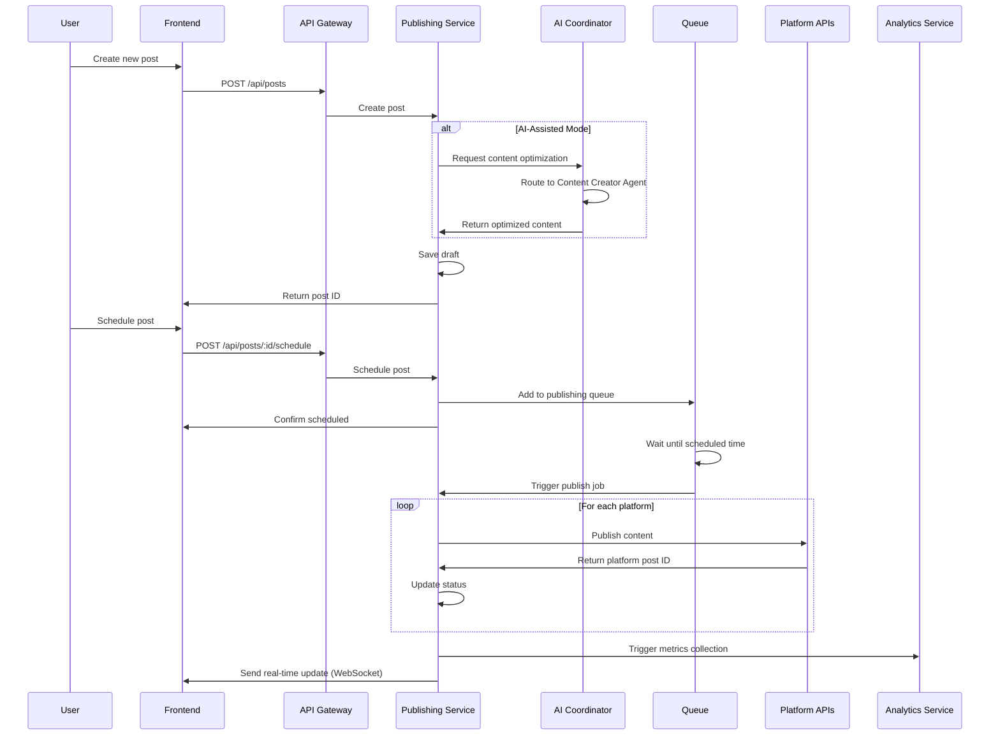
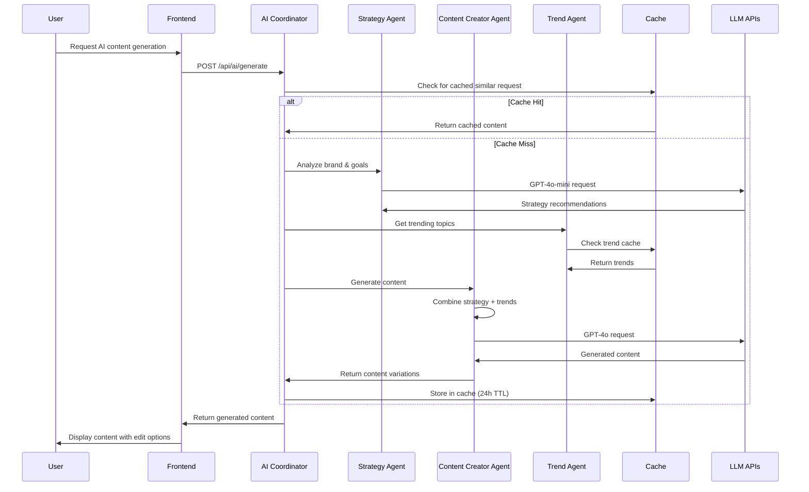
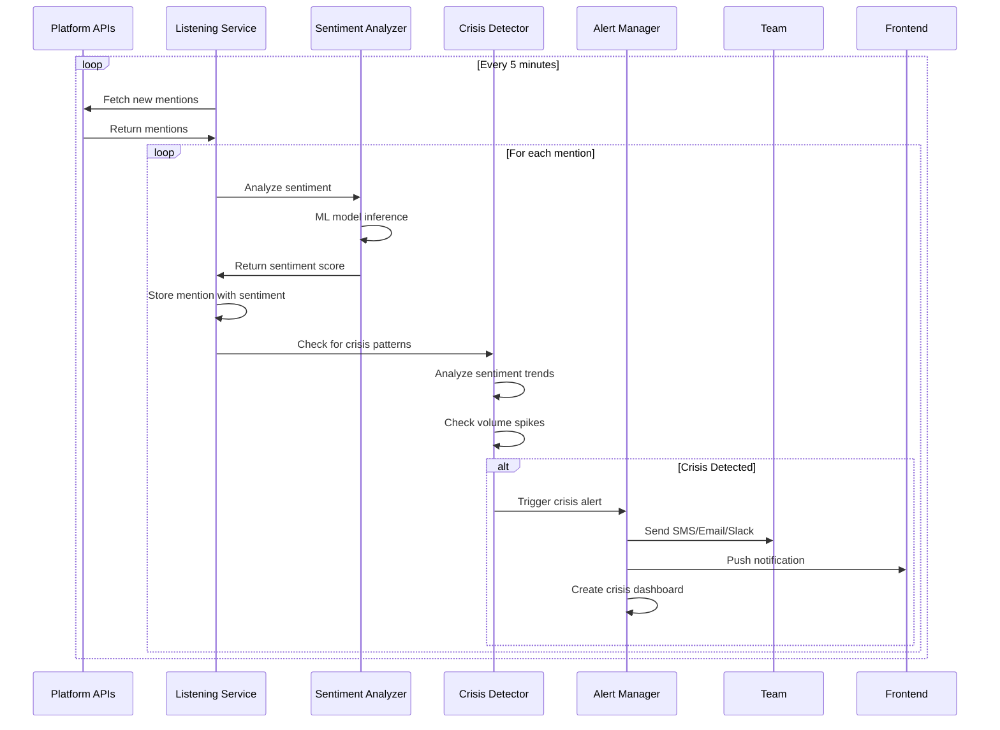
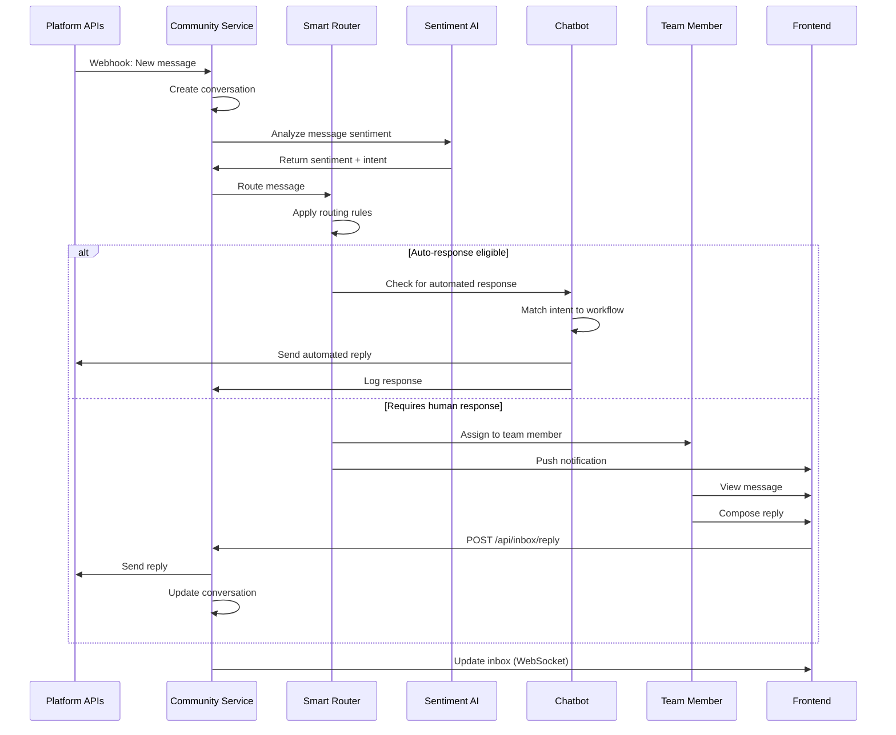
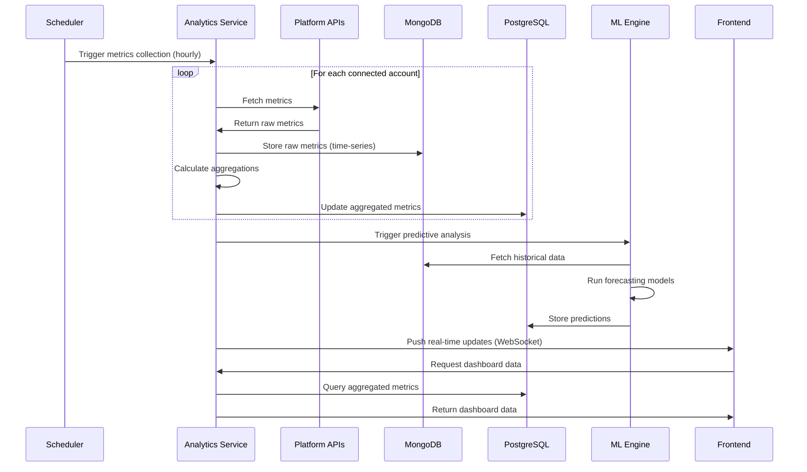
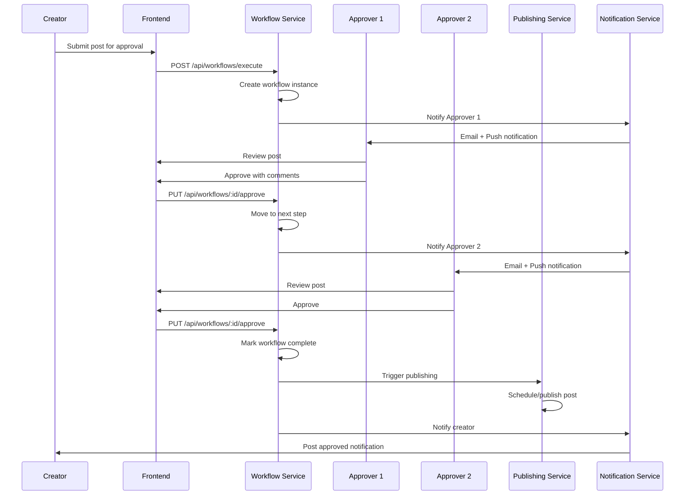

# Design Document - AI-Native Social Media Management Platform

## Overview

This document provides comprehensive architectural design, system flows, component specifications, and technical implementation details for an enterprise-grade, AI-native social media management platform. The platform combines autonomous multi-agent AI architecture with comprehensive social media management capabilities, delivering enterprise features at SMB pricing through aggressive optimization.

### Design Principles

1. **AI-First Architecture**: Every component leverages AI for automation, optimization, and intelligence
2. **Microservices Design**: Loosely coupled services enabling independent scaling and deployment
3. **Multi-Tenancy**: Complete workspace isolation with shared infrastructure for cost efficiency
4. **Real-Time Processing**: Event-driven architecture for instant updates and notifications
5. **Scalability**: Horizontal scaling supporting 10,000+ concurrent users per workspace
6. **Security**: Zero-trust architecture with encryption, compliance, and audit trails
7. **Cost Optimization**: Intelligent resource allocation minimizing AI and infrastructure costs
8. **Developer Experience**: Clean APIs, comprehensive documentation, and extensibility

### Technology Stack

**Frontend:**
- Next.js 14 (App Router) - React framework with SSR/SSG
- TypeScript - Type safety and developer experience
- Tailwind CSS - Utility-first styling
- Shadcn/ui - Component library
- TanStack Query - Data fetching and caching
- Zustand - State management
- React Hook Form + Zod - Form handling and validation
- Recharts - Data visualization
- Socket.io Client - Real-time updates

**Backend:**
- Node.js 20+ with TypeScript - Runtime environment
- NestJS - Enterprise Node.js framework
- PostgreSQL 16 - Primary relational database
- Redis - Caching and session management
- MongoDB - Document storage for analytics and logs
- BullMQ - Job queue and background processing
- Socket.io - WebSocket server for real-time features
- Prisma - Type-safe ORM
- GraphQL (Apollo) - API layer with REST fallback

**AI/ML Stack:**
- OpenAI GPT-4o, GPT-4o-mini - Content generation and analysis
- Anthropic Claude 3.5 Sonnet, Haiku - Alternative LLM provider
- CrewAI - Multi-agent orchestration framework
- LangChain - LLM application framework
- Pinecone - Vector database for semantic search
- Hugging Face Transformers - Sentiment analysis and NLP
- TensorFlow.js - Client-side ML capabilities

**Infrastructure:**
- AWS/GCP - Cloud infrastructure
- Docker + Kubernetes - Containerization and orchestration
- Terraform - Infrastructure as code
- GitHub Actions - CI/CD pipeline
- Cloudflare - CDN and DDoS protection
- Sentry - Error tracking and monitoring
- DataDog - Application performance monitoring
- Elasticsearch - Log aggregation and search

**Third-Party Integrations:**
- Social Platform APIs (Meta, Twitter, LinkedIn, TikTok, etc.)
- Stripe - Payment processing
- SendGrid - Transactional email
- Twilio - SMS notifications
- AWS S3 - Media storage
- Cloudinary - Image optimization
- FFmpeg - Video processing

## Architecture


### High-Level System Architecture

```mermaid
graph TB
    subgraph "Client Layer"
        WEB[Web Application<br/>Next.js]
        MOBILE[Mobile Apps<br/>React Native]
        API_CLIENT[API Clients<br/>Third-party]
    end

    subgraph "API Gateway Layer"
        GATEWAY[API Gateway<br/>Kong/AWS API Gateway]
        AUTH[Auth Service<br/>JWT + OAuth]
        RATE_LIMIT[Rate Limiter<br/>Redis]
    end

    subgraph "Application Services"
        PUBLISHING[Publishing Service<br/>Content Management]
        ANALYTICS[Analytics Service<br/>Data Processing]
        LISTENING[Listening Service<br/>Social Monitoring]
        COMMUNITY[Community Service<br/>Inbox Management]
        AI_COORD[AI Coordinator<br/>Multi-Agent System]
        COMMERCE[Commerce Service<br/>E-commerce Integration]
        INFLUENCER[Influencer Service<br/>Discovery & Management]
        WORKFLOW[Workflow Service<br/>Approvals & Automation]
    end

    subgraph "AI Agent Layer"
        CONTENT_AI[Content Creator Agent]
        STRATEGY_AI[Strategy Agent]
        ENGAGEMENT_AI[Engagement Agent]
        ANALYTICS_AI[Analytics Agent]
        TREND_AI[Trend Detection Agent]
        COMPETITOR_AI[Competitor Analysis Agent]
        CRISIS_AI[Crisis Management Agent]
        SENTIMENT_AI[Sentiment Analysis Agent]
    end

    subgraph "Data Layer"
        POSTGRES[(PostgreSQL<br/>Primary DB)]
        MONGO[(MongoDB<br/>Analytics & Logs)]
        REDIS[(Redis<br/>Cache & Queue)]
        PINECONE[(Pinecone<br/>Vector DB)]
        S3[(S3<br/>Media Storage)]
    end

    subgraph "External Services"
        SOCIAL_APIS[Social Platform APIs<br/>Meta, Twitter, LinkedIn, etc.]
        AI_APIS[AI APIs<br/>OpenAI, Anthropic]
        PAYMENT[Payment Gateway<br/>Stripe]
        EMAIL[Email Service<br/>SendGrid]
        SMS[SMS Service<br/>Twilio]
    end

    subgraph "Background Processing"
        QUEUE[Job Queue<br/>BullMQ]
        SCHEDULER[Scheduler<br/>Cron Jobs]
        WORKER[Worker Nodes<br/>Background Tasks]
    end

    WEB --> GATEWAY
    MOBILE --> GATEWAY
    API_CLIENT --> GATEWAY
    
    GATEWAY --> AUTH
    GATEWAY --> RATE_LIMIT
    GATEWAY --> PUBLISHING
    GATEWAY --> ANALYTICS
    GATEWAY --> LISTENING
    GATEWAY --> COMMUNITY
    GATEWAY --> AI_COORD
    GATEWAY --> COMMERCE
    GATEWAY --> INFLUENCER
    GATEWAY --> WORKFLOW

    PUBLISHING --> POSTGRES
    PUBLISHING --> REDIS
    PUBLISHING --> S3
    PUBLISHING --> QUEUE
    
    ANALYTICS --> MONGO
    ANALYTICS --> POSTGRES
    ANALYTICS --> REDIS
    
    LISTENING --> MONGO
    LISTENING --> REDIS
    LISTENING --> PINECONE
    
    COMMUNITY --> POSTGRES
    COMMUNITY --> REDIS
    
    AI_COORD --> CONTENT_AI
    AI_COORD --> STRATEGY_AI
    AI_COORD --> ENGAGEMENT_AI
    AI_COORD --> ANALYTICS_AI
    AI_COORD --> TREND_AI
    AI_COORD --> COMPETITOR_AI
    AI_COORD --> CRISIS_AI
    AI_COORD --> SENTIMENT_AI
    
    AI_COORD --> PINECONE
    AI_COORD --> REDIS
    AI_COORD --> AI_APIS
    
    PUBLISHING --> SOCIAL_APIS
    LISTENING --> SOCIAL_APIS
    COMMUNITY --> SOCIAL_APIS
    
    COMMERCE --> SOCIAL_APIS
    COMMERCE --> POSTGRES
    
    QUEUE --> WORKER
    SCHEDULER --> WORKER
    WORKER --> SOCIAL_APIS
    WORKER --> EMAIL
    WORKER --> SMS
    
    AUTH --> PAYMENT
```



### Microservices Architecture

#### 1. Publishing Service
**Responsibility**: Content creation, scheduling, and publishing across social platforms

**Key Components:**
- Content Manager: CRUD operations for posts
- Scheduler: Time-based content publishing
- Platform Adapters: Platform-specific API integrations
- Media Processor: Image/video optimization
- Queue Manager: Async publishing jobs

**Database Schema:**
- `posts` - Content items with metadata
- `scheduled_posts` - Publishing schedule
- `post_versions` - Version history
- `media_assets` - Media library
- `publishing_logs` - Audit trail

**APIs:**
- `POST /api/posts` - Create post
- `GET /api/posts` - List posts
- `PUT /api/posts/:id` - Update post
- `DELETE /api/posts/:id` - Delete post
- `POST /api/posts/:id/schedule` - Schedule post
- `POST /api/posts/:id/publish` - Publish immediately
- `POST /api/posts/bulk` - Bulk operations

#### 2. Analytics Service
**Responsibility**: Data collection, processing, and visualization

**Key Components:**
- Data Collector: Fetch metrics from platforms
- Metrics Processor: Aggregate and calculate KPIs
- Report Generator: Create custom reports
- Predictive Engine: ML-based forecasting
- Export Manager: Data export functionality

**Database Schema:**
- `metrics` - Raw metric data (time-series)
- `aggregated_metrics` - Pre-calculated aggregations
- `reports` - Saved reports
- `dashboards` - Custom dashboards
- `benchmarks` - Competitive data

**APIs:**
- `GET /api/analytics/overview` - Dashboard data
- `GET /api/analytics/posts/:id` - Post performance
- `GET /api/analytics/accounts/:id` - Account metrics
- `POST /api/analytics/reports` - Generate report
- `GET /api/analytics/competitors` - Competitive analysis
- `GET /api/analytics/predictions` - Predictive insights


#### 3. Listening Service
**Responsibility**: Social listening, brand monitoring, and trend detection

**Key Components:**
- Stream Processor: Real-time social media monitoring
- Keyword Matcher: Boolean search and filtering
- Sentiment Analyzer: AI-powered sentiment detection
- Trend Detector: Identify emerging topics
- Alert Manager: Real-time notifications

**Database Schema:**
- `mentions` - Tracked mentions and keywords
- `listening_queries` - Saved searches
- `sentiment_data` - Sentiment analysis results
- `trends` - Detected trends
- `alerts` - Alert configurations

**APIs:**
- `POST /api/listening/queries` - Create monitoring query
- `GET /api/listening/mentions` - Fetch mentions
- `GET /api/listening/sentiment` - Sentiment analysis
- `GET /api/listening/trends` - Trending topics
- `POST /api/listening/alerts` - Configure alerts

#### 4. Community Service
**Responsibility**: Unified inbox, message management, and engagement

**Key Components:**
- Inbox Aggregator: Collect messages from all platforms
- Smart Router: AI-powered message routing
- Response Manager: Reply handling and templates
- Conversation Tracker: Thread management
- SLA Monitor: Response time tracking

**Database Schema:**
- `conversations` - Message threads
- `messages` - Individual messages
- `saved_replies` - Template responses
- `assignments` - Team member assignments
- `sla_configs` - SLA rules

**APIs:**
- `GET /api/inbox/messages` - Fetch messages
- `POST /api/inbox/messages/:id/reply` - Send reply
- `PUT /api/inbox/messages/:id/assign` - Assign to team member
- `POST /api/inbox/templates` - Create reply template
- `GET /api/inbox/analytics` - Response metrics

#### 5. AI Coordinator Service
**Responsibility**: Multi-agent orchestration and AI operations

**Key Components:**
- Agent Manager: Deploy and manage AI agents
- Task Orchestrator: Coordinate agent workflows
- Model Router: Route requests to optimal models
- Cache Manager: AI response caching
- Cost Tracker: Monitor AI spending

**Database Schema:**
- `agent_configs` - Agent configurations
- `agent_tasks` - Task history
- `ai_cache` - Cached responses
- `ai_costs` - Cost tracking
- `brand_profiles` - Brand voice training data

**APIs:**
- `POST /api/ai/generate` - Generate content
- `POST /api/ai/analyze` - Analyze content
- `POST /api/ai/optimize` - Optimize content
- `GET /api/ai/suggestions` - Get recommendations
- `POST /api/ai/train` - Train brand voice

#### 6. Commerce Service
**Responsibility**: Social commerce and e-commerce integration

**Key Components:**
- Product Sync: Sync product catalogs
- Shoppable Post Creator: Tag products in posts
- Conversion Tracker: Track sales attribution
- Inventory Manager: Monitor stock levels
- Revenue Analytics: E-commerce metrics

**Database Schema:**
- `products` - Product catalog
- `product_tags` - Product-post associations
- `conversions` - Conversion events
- `commerce_analytics` - Sales metrics

**APIs:**
- `POST /api/commerce/products/sync` - Sync products
- `POST /api/commerce/posts/:id/tag` - Tag products
- `GET /api/commerce/analytics` - Commerce metrics
- `GET /api/commerce/conversions` - Conversion data

#### 7. Influencer Service
**Responsibility**: Influencer discovery, management, and campaigns

**Key Components:**
- Discovery Engine: Find relevant influencers
- Authenticity Checker: Verify audience quality
- Relationship Manager: Track collaborations
- Campaign Tracker: Monitor campaign performance
- Payment Manager: Handle influencer payments

**Database Schema:**
- `influencers` - Influencer profiles
- `influencer_campaigns` - Campaign data
- `collaborations` - Partnership history
- `payments` - Payment tracking

**APIs:**
- `GET /api/influencers/search` - Search influencers
- `POST /api/influencers/:id/analyze` - Analyze influencer
- `POST /api/influencers/campaigns` - Create campaign
- `GET /api/influencers/campaigns/:id` - Campaign metrics

#### 8. Workflow Service
**Responsibility**: Approval workflows, automation, and business logic

**Key Components:**
- Workflow Engine: Execute approval flows
- Rule Engine: Automation rules
- Notification Manager: Alert stakeholders
- Audit Logger: Track all actions
- Chatbot Builder: Conversational workflows

**Database Schema:**
- `workflows` - Workflow definitions
- `workflow_instances` - Active workflows
- `approvals` - Approval requests
- `automation_rules` - Automation configs
- `audit_logs` - Complete audit trail

**APIs:**
- `POST /api/workflows` - Create workflow
- `POST /api/workflows/:id/execute` - Start workflow
- `PUT /api/workflows/:id/approve` - Approve step
- `POST /api/automation/rules` - Create automation
- `GET /api/audit/logs` - Fetch audit logs

### Data Models

#### Core Entities

**User**
```typescript
interface User {
  id: string;
  email: string;
  name: string;
  avatar?: string;
  role: 'owner' | 'admin' | 'manager' | 'editor' | 'viewer';
  workspaceId: string;
  permissions: Permission[];
  preferences: UserPreferences;
  createdAt: Date;
  updatedAt: Date;
}
```

**Workspace**
```typescript
interface Workspace {
  id: string;
  name: string;
  slug: string;
  plan: 'free' | 'starter' | 'professional' | 'enterprise';
  settings: WorkspaceSettings;
  branding: BrandingConfig;
  limits: UsageLimits;
  billing: BillingInfo;
  createdAt: Date;
  updatedAt: Date;
}
```

**SocialAccount**
```typescript
interface SocialAccount {
  id: string;
  workspaceId: string;
  platform: Platform;
  platformAccountId: string;
  username: string;
  displayName: string;
  avatar: string;
  accessToken: string; // encrypted
  refreshToken: string; // encrypted
  tokenExpiry: Date;
  isActive: boolean;
  metadata: PlatformMetadata;
  createdAt: Date;
  updatedAt: Date;
}

type Platform = 'instagram' | 'facebook' | 'twitter' | 'linkedin' | 
                'tiktok' | 'youtube' | 'pinterest' | 'threads' | 'reddit';
```

**Post**
```typescript
interface Post {
  id: string;
  workspaceId: string;
  authorId: string;
  content: PostContent;
  platforms: PlatformPost[];
  status: PostStatus;
  scheduledAt?: Date;
  publishedAt?: Date;
  campaign?: string;
  tags: string[];
  aiGenerated: boolean;
  aiMetadata?: AIMetadata;
  approvalStatus?: ApprovalStatus;
  analytics?: PostAnalytics;
  createdAt: Date;
  updatedAt: Date;
}

interface PostContent {
  text: string;
  media: MediaAsset[];
  hashtags: string[];
  mentions: string[];
  link?: string;
  firstComment?: string;
}

interface PlatformPost {
  platform: Platform;
  accountId: string;
  customContent?: Partial<PostContent>;
  platformPostId?: string;
  publishStatus: 'pending' | 'published' | 'failed';
  error?: string;
}

type PostStatus = 'draft' | 'scheduled' | 'published' | 'failed';
```

**MediaAsset**
```typescript
interface MediaAsset {
  id: string;
  workspaceId: string;
  type: 'image' | 'video' | 'gif';
  url: string;
  thumbnailUrl?: string;
  filename: string;
  size: number;
  dimensions?: { width: number; height: number };
  duration?: number; // for videos
  metadata: MediaMetadata;
  tags: string[];
  folder?: string;
  createdAt: Date;
}
```


**Conversation**
```typescript
interface Conversation {
  id: string;
  workspaceId: string;
  platform: Platform;
  accountId: string;
  type: 'comment' | 'dm' | 'mention' | 'review';
  participantId: string; // external user
  participantName: string;
  messages: Message[];
  status: 'open' | 'pending' | 'resolved' | 'archived';
  priority: 'low' | 'medium' | 'high' | 'urgent';
  sentiment: 'positive' | 'neutral' | 'negative';
  assignedTo?: string;
  tags: string[];
  slaDeadline?: Date;
  createdAt: Date;
  updatedAt: Date;
}

interface Message {
  id: string;
  conversationId: string;
  direction: 'inbound' | 'outbound';
  content: string;
  media?: MediaAsset[];
  authorId?: string; // internal user
  platformMessageId: string;
  sentiment?: number; // -1 to 1
  aiGenerated: boolean;
  createdAt: Date;
}
```

**Mention**
```typescript
interface Mention {
  id: string;
  workspaceId: string;
  queryId: string;
  platform: Platform;
  author: {
    id: string;
    username: string;
    name: string;
    avatar: string;
    followers: number;
  };
  content: string;
  url: string;
  sentiment: 'positive' | 'neutral' | 'negative';
  sentimentScore: number;
  reach: number;
  engagement: number;
  language: string;
  location?: string;
  isInfluencer: boolean;
  tags: string[];
  createdAt: Date;
  fetchedAt: Date;
}
```

**Campaign**
```typescript
interface Campaign {
  id: string;
  workspaceId: string;
  name: string;
  description: string;
  startDate: Date;
  endDate: Date;
  goals: CampaignGoal[];
  budget?: number;
  tags: string[];
  utmParams: UTMParams;
  posts: string[]; // post IDs
  status: 'draft' | 'active' | 'paused' | 'completed';
  analytics?: CampaignAnalytics;
  createdAt: Date;
  updatedAt: Date;
}

interface CampaignGoal {
  metric: string;
  target: number;
  current: number;
}
```

**AIAgent**
```typescript
interface AIAgent {
  id: string;
  type: AgentType;
  name: string;
  description: string;
  personality: string;
  model: 'gpt-4o' | 'gpt-4o-mini' | 'claude-3.5-sonnet' | 'claude-haiku';
  systemPrompt: string;
  temperature: number;
  maxTokens: number;
  tools: AgentTool[];
  isActive: boolean;
}

type AgentType = 'content_creator' | 'strategy' | 'engagement' | 
                 'analytics' | 'trend_detection' | 'competitor_analysis' |
                 'crisis_management' | 'sentiment_analysis';

interface AgentTool {
  name: string;
  description: string;
  parameters: Record<string, any>;
}
```

### System Flows

#### Flow 1: Content Creation and Publishing



#### Flow 2: AI Multi-Agent Content Generation



#### Flow 3: Social Listening and Crisis Detection



#### Flow 4: Unified Inbox Message Handling




#### Flow 5: Analytics Data Collection and Processing



#### Flow 6: Approval Workflow



### Component Specifications

#### Frontend Components

**1. Dashboard Page**
```
Location: /app/dashboard
Purpose: Overview of all social media activity and key metrics

Components:
├── DashboardHeader
│   ├── WorkspaceSwitcher
│   ├── DateRangePicker
│   └── RefreshButton
├── MetricsOverview
│   ├── MetricCard (Followers)
│   ├── MetricCard (Engagement)
│   ├── MetricCard (Reach)
│   └── MetricCard (Posts Published)
├── EngagementChart
│   └── LineChart (Time-series data)
├── TopPerformingPosts
│   └── PostCard[] (Grid layout)
├── PlatformBreakdown
│   └── PieChart (Platform distribution)
├── RecentActivity
│   └── ActivityFeed
└── QuickActions
    ├── CreatePostButton
    ├── ViewInboxButton
    └── ViewAnalyticsButton

State Management:
- metrics: DashboardMetrics
- dateRange: { start: Date, end: Date }
- loading: boolean
- error: Error | null

API Calls:
- GET /api/analytics/overview
- GET /api/posts/top-performing
- GET /api/activity/recent

Real-time Updates:
- WebSocket connection for live metrics
- Auto-refresh every 5 minutes
```

**2. Content Calendar Page**
```
Location: /app/content
Purpose: Visual calendar for scheduling and managing posts

Components:
├── CalendarHeader
│   ├── ViewToggle (Month/Week/Day)
│   ├── DateNavigator
│   └── FilterBar
├── CalendarGrid
│   ├── CalendarDay[]
│   │   └── ScheduledPost[]
│   └── DragDropContext
├── PostPreviewModal
│   ├── PostContent
│   ├── PlatformPreviews[]
│   └── EditButton
├── CreatePostSidebar
│   ├── ContentEditor
│   ├── MediaUploader
│   ├── PlatformSelector
│   ├── SchedulePicker
│   └── AIAssistButton
└── BulkActionsBar
    ├── BulkEditButton
    ├── BulkDeleteButton
    └── BulkRescheduleButton

State Management:
- posts: Post[]
- selectedDate: Date
- view: 'month' | 'week' | 'day'
- filters: FilterState
- draggedPost: Post | null

API Calls:
- GET /api/posts?start=&end=
- POST /api/posts
- PUT /api/posts/:id
- DELETE /api/posts/:id
- POST /api/posts/:id/schedule

Features:
- Drag-and-drop rescheduling
- Multi-select for bulk operations
- Color coding by platform
- Status indicators (draft/scheduled/published)
- Quick preview on hover
```

**3. AI Hub Page**
```
Location: /app/ai-hub
Purpose: AI-powered content generation and optimization

Components:
├── AIHubHeader
│   ├── AgentStatusIndicators[]
│   └── CostTracker
├── ContentGenerationPanel
│   ├── PromptInput
│   ├── ToneSelector
│   ├── PlatformSelector
│   ├── GenerateButton
│   └── GeneratedVariations[]
├── ContentOptimizer
│   ├── ContentInput
│   ├── OptimizationSuggestions[]
│   └── ApplyButton
├── HashtagGenerator
│   ├── ContentAnalyzer
│   └── HashtagSuggestions[]
├── BrandVoiceTrainer
│   ├── ExampleContentInput[]
│   ├── TrainButton
│   └── VoiceProfile
├── StrategyAssistant
│   ├── GoalsInput
│   ├── AnalysisResults
│   └── Recommendations[]
└── AutomationSettings
    ├── AutomationModeSelector
    ├── FrequencySettings
    └── ContentCategoryRules[]

State Management:
- agents: AIAgent[]
- generatedContent: ContentVariation[]
- brandVoice: BrandVoiceProfile
- automationConfig: AutomationSettings
- aiCosts: CostMetrics

API Calls:
- POST /api/ai/generate
- POST /api/ai/optimize
- POST /api/ai/hashtags
- POST /api/ai/train
- GET /api/ai/suggestions
- PUT /api/ai/automation

Features:
- Real-time content generation
- Multiple variations
- A/B testing suggestions
- Cost estimation per generation
- Brand voice consistency scoring
```

**4. Inbox Page**
```
Location: /app/inbox
Purpose: Unified social media inbox for all interactions

Components:
├── InboxHeader
│   ├── FilterTabs (All/Unread/Assigned/Urgent)
│   ├── SearchBar
│   └── SortDropdown
├── ConversationList
│   ├── ConversationCard[]
│   │   ├── Avatar
│   │   ├── Name
│   │   ├── Preview
│   │   ├── Platform Badge
│   │   ├── Sentiment Indicator
│   │   ├── Priority Badge
│   │   └── Timestamp
│   └── LoadMoreButton
├── ConversationView
│   ├── ConversationHeader
│   │   ├── ParticipantInfo
│   │   ├── AssignButton
│   │   ├── TagButton
│   │   └── StatusDropdown
│   ├── MessageThread
│   │   └── Message[]
│   ├── ReplyComposer
│   │   ├── TextEditor
│   │   ├── TemplateSelector
│   │   ├── MediaAttacher
│   │   ├── AIAssistButton
│   │   └── SendButton
│   └── ConversationSidebar
│       ├── ParticipantDetails
│       ├── ConversationHistory
│       ├── Tags
│       └── Notes
└── InboxStats
    ├── ResponseTimeMetric
    ├── ResolutionRateMetric
    └── TeamPerformance

State Management:
- conversations: Conversation[]
- selectedConversation: Conversation | null
- filters: InboxFilters
- unreadCount: number
- assignedToMe: number

API Calls:
- GET /api/inbox/conversations
- GET /api/inbox/messages/:conversationId
- POST /api/inbox/reply
- PUT /api/inbox/assign
- PUT /api/inbox/status

Real-time Updates:
- WebSocket for new messages
- Push notifications
- Unread count updates
- Typing indicators
```

**5. Analytics Page**
```
Location: /app/analytics
Purpose: Comprehensive analytics and reporting

Components:
├── AnalyticsHeader
│   ├── DateRangePicker
│   ├── AccountSelector
│   ├── CompareToggle
│   └── ExportButton
├── MetricsTabs
│   ├── OverviewTab
│   ├── PostsTab
│   ├── AudienceTab
│   ├── EngagementTab
│   └── ConversionsTab
├── OverviewTab
│   ├── KPICards[]
│   ├── EngagementTrendChart
│   ├── FollowerGrowthChart
│   ├── TopPostsTable
│   └── PlatformComparison
├── PostsTab
│   ├── PostPerformanceTable
│   ├── ContentTypeBreakdown
│   ├── BestTimeToPost
│   └── HashtagPerformance
├── AudienceTab
│   ├── DemographicsChart
│   ├── LocationMap
│   ├── InterestsCloud
│   └── GrowthAnalysis
├── EngagementTab
│   ├── EngagementRateChart
│   ├── InteractionTypes
│   ├── ResponseTimeMetrics
│   └── SentimentAnalysis
├── ConversionsTab
│   ├── ConversionFunnel
│   ├── AttributionChart
│   ├── RevenueMetrics
│   └── ROICalculator
└── ReportBuilder
    ├── WidgetSelector
    ├── CustomDashboard
    ├── ScheduleReportButton
    └── ShareButton

State Management:
- metrics: AnalyticsData
- dateRange: DateRange
- selectedAccounts: string[]
- compareMode: boolean
- customReport: ReportConfig

API Calls:
- GET /api/analytics/overview
- GET /api/analytics/posts
- GET /api/analytics/audience
- GET /api/analytics/engagement
- GET /api/analytics/conversions
- POST /api/analytics/reports

Features:
- Interactive charts with drill-down
- Export to PDF/CSV/Excel
- Scheduled report delivery
- Custom dashboard builder
- Predictive insights
- Competitive benchmarking
```


**6. Listening Page**
```
Location: /app/listening
Purpose: Social listening and brand monitoring

Components:
├── ListeningHeader
│   ├── QuerySelector
│   ├── CreateQueryButton
│   └── DateRangePicker
├── QueryBuilder
│   ├── KeywordInput
│   ├── BooleanOperators
│   ├── PlatformSelector
│   ├── LanguageSelector
│   ├── LocationFilter
│   └── SaveQueryButton
├── MentionsStream
│   ├── FilterBar
│   ├── SortOptions
│   ├── MentionCard[]
│   │   ├── AuthorInfo
│   │   ├── Content
│   │   ├── SentimentBadge
│   │   ├── ReachMetrics
│   │   ├── EngageButton
│   │   └── SaveButton
│   └── LoadMoreButton
├── SentimentAnalysis
│   ├── SentimentGauge
│   ├── SentimentTrend
│   └── SentimentBreakdown
├── TrendingTopics
│   ├── TrendCard[]
│   └── TrendChart
├── InfluencerSpotlight
│   ├── TopInfluencers[]
│   └── InfluencerMetrics
├── CompetitorTracking
│   ├── CompetitorSelector
│   ├── ShareOfVoice
│   └── CompetitorActivity
└── AlertsPanel
    ├── ActiveAlerts[]
    ├── CreateAlertButton
    └── AlertHistory

State Management:
- queries: ListeningQuery[]
- mentions: Mention[]
- sentiment: SentimentData
- trends: Trend[]
- alerts: Alert[]

API Calls:
- GET /api/listening/mentions
- POST /api/listening/queries
- GET /api/listening/sentiment
- GET /api/listening/trends
- POST /api/listening/alerts

Real-time Updates:
- WebSocket for new mentions
- Live sentiment updates
- Trend notifications
- Crisis alerts
```

**7. Media Library Page**
```
Location: /app/media
Purpose: Asset management and organization

Components:
├── MediaHeader
│   ├── UploadButton
│   ├── SearchBar
│   ├── ViewToggle (Grid/List)
│   └── SortDropdown
├── FolderTree
│   ├── FolderNode[]
│   ├── CreateFolderButton
│   └── DragDropContext
├── MediaGrid
│   ├── MediaCard[]
│   │   ├── Thumbnail
│   │   ├── Filename
│   │   ├── FileSize
│   │   ├── Dimensions
│   │   ├── Tags
│   │   └── ActionMenu
│   └── InfiniteScroll
├── MediaUploader
│   ├── DropZone
│   ├── FileList[]
│   ├── ProgressBars[]
│   └── UploadButton
├── MediaEditor
│   ├── ImageEditor (Crop, Resize, Filters)
│   ├── VideoTrimmer
│   └── SaveButton
├── MediaDetails
│   ├── Preview
│   ├── Metadata
│   ├── TagEditor
│   ├── UsageHistory
│   └── ShareButton
└── BulkActions
    ├── SelectAll
    ├── BulkTag
    ├── BulkMove
    └── BulkDelete

State Management:
- assets: MediaAsset[]
- selectedFolder: string
- selectedAssets: string[]
- uploadProgress: UploadProgress[]
- filters: MediaFilters

API Calls:
- GET /api/media
- POST /api/media/upload
- PUT /api/media/:id
- DELETE /api/media/:id
- POST /api/media/folders

Features:
- Drag-and-drop upload
- Bulk operations
- Image editing
- Video trimming
- AI-powered tagging
- Usage tracking
- CDN integration
```

**8. Team Page**
```
Location: /app/team
Purpose: Team member and permission management

Components:
├── TeamHeader
│   ├── InviteButton
│   └── SearchBar
├── TeamMemberList
│   ├── MemberCard[]
│   │   ├── Avatar
│   │   ├── Name
│   │   ├── Email
│   │   ├── Role Badge
│   │   ├── Status
│   │   ├── LastActive
│   │   └── ActionMenu
│   └── PendingInvites[]
├── InviteModal
│   ├── EmailInput
│   ├── RoleSelector
│   ├── PermissionCheckboxes[]
│   └── SendInviteButton
├── RoleManagement
│   ├── RoleCard[]
│   ├── CreateRoleButton
│   └── PermissionMatrix
├── TeamAnalytics
│   ├── ActivityMetrics
│   ├── PerformanceChart
│   └── ResponseTimeMetrics
└── AuditLog
    ├── FilterBar
    ├── LogEntry[]
    └── ExportButton

State Management:
- members: TeamMember[]
- roles: Role[]
- permissions: Permission[]
- auditLogs: AuditLog[]

API Calls:
- GET /api/team/members
- POST /api/team/invite
- PUT /api/team/members/:id
- DELETE /api/team/members/:id
- GET /api/team/audit-logs

Features:
- Role-based access control
- Custom permission sets
- Activity tracking
- Audit trail
- SSO integration
```

**9. Settings Page**
```
Location: /app/settings
Purpose: Workspace and account configuration

Components:
├── SettingsSidebar
│   ├── GeneralNav
│   ├── AccountsNav
│   ├── BrandingNav
│   ├── WorkflowsNav
│   ├── IntegrationsNav
│   ├── BillingNav
│   └── SecurityNav
├── GeneralSettings
│   ├── WorkspaceInfo
│   ├── TimezoneSelector
│   ├── LanguageSelector
│   └── NotificationPreferences
├── AccountsSettings
│   ├── ConnectedAccounts[]
│   ├── ConnectAccountButton
│   └── AccountHealth
├── BrandingSettings
│   ├── LogoUploader
│   ├── ColorPicker
│   ├── FontSelector
│   ├── BrandVoiceEditor
│   └── BrandGuidelines
├── WorkflowsSettings
│   ├── ApprovalWorkflows[]
│   ├── AutomationRules[]
│   └── CreateWorkflowButton
├── IntegrationsSettings
│   ├── AvailableIntegrations[]
│   ├── ActiveIntegrations[]
│   └── APIKeys
├── BillingSettings
│   ├── CurrentPlan
│   ├── UsageMetrics
│   ├── PaymentMethod
│   ├── InvoiceHistory
│   └── UpgradeButton
└── SecuritySettings
    ├── PasswordChange
    ├── TwoFactorAuth
    ├── SSOConfiguration
    ├── IPWhitelist
    └── SessionManagement

State Management:
- settings: WorkspaceSettings
- connectedAccounts: SocialAccount[]
- integrations: Integration[]
- billing: BillingInfo

API Calls:
- GET /api/settings
- PUT /api/settings
- GET /api/accounts
- POST /api/accounts/connect
- GET /api/integrations
- GET /api/billing
```

### Backend API Specifications

#### Authentication & Authorization

**POST /api/auth/register**
```typescript
Request:
{
  email: string;
  password: string;
  name: string;
  workspaceName: string;
}

Response:
{
  user: User;
  workspace: Workspace;
  accessToken: string;
  refreshToken: string;
}
```

**POST /api/auth/login**
```typescript
Request:
{
  email: string;
  password: string;
}

Response:
{
  user: User;
  accessToken: string;
  refreshToken: string;
}
```

**POST /api/auth/refresh**
```typescript
Request:
{
  refreshToken: string;
}

Response:
{
  accessToken: string;
  refreshToken: string;
}
```

#### Publishing APIs

**POST /api/posts**
```typescript
Request:
{
  content: {
    text: string;
    media: string[]; // media IDs
    hashtags: string[];
    mentions: string[];
    link?: string;
    firstComment?: string;
  };
  platforms: {
    platform: Platform;
    accountId: string;
    customContent?: Partial<PostContent>;
  }[];
  scheduledAt?: Date;
  campaign?: string;
  tags?: string[];
}

Response:
{
  post: Post;
}
```

**GET /api/posts**
```typescript
Query Parameters:
{
  status?: PostStatus;
  platform?: Platform;
  startDate?: Date;
  endDate?: Date;
  campaign?: string;
  page?: number;
  limit?: number;
}

Response:
{
  posts: Post[];
  total: number;
  page: number;
  limit: number;
}
```

**PUT /api/posts/:id**
```typescript
Request:
{
  content?: Partial<PostContent>;
  platforms?: PlatformPost[];
  scheduledAt?: Date;
  tags?: string[];
}

Response:
{
  post: Post;
}
```

**POST /api/posts/:id/publish**
```typescript
Response:
{
  post: Post;
  results: {
    platform: Platform;
    success: boolean;
    platformPostId?: string;
    error?: string;
  }[];
}
```

**POST /api/posts/bulk**
```typescript
Request:
{
  action: 'schedule' | 'delete' | 'update';
  postIds: string[];
  data?: any; // action-specific data
}

Response:
{
  success: number;
  failed: number;
  errors: { postId: string; error: string }[];
}
```

#### Analytics APIs

**GET /api/analytics/overview**
```typescript
Query Parameters:
{
  startDate: Date;
  endDate: Date;
  accounts?: string[];
  compareWith?: { startDate: Date; endDate: Date };
}

Response:
{
  metrics: {
    followers: { current: number; change: number; changePercent: number };
    engagement: { current: number; change: number; changePercent: number };
    reach: { current: number; change: number; changePercent: number };
    posts: { current: number; change: number; changePercent: number };
  };
  charts: {
    engagement: TimeSeriesData[];
    followerGrowth: TimeSeriesData[];
    platformBreakdown: PlatformData[];
  };
  topPosts: Post[];
}
```

**GET /api/analytics/posts/:id**
```typescript
Response:
{
  post: Post;
  metrics: {
    impressions: number;
    reach: number;
    engagement: number;
    likes: number;
    comments: number;
    shares: number;
    saves: number;
    clicks: number;
  };
  platformMetrics: {
    platform: Platform;
    metrics: Record<string, number>;
  }[];
  timeline: TimeSeriesData[];
}
```

**POST /api/analytics/reports**
```typescript
Request:
{
  name: string;
  type: 'overview' | 'posts' | 'audience' | 'engagement' | 'custom';
  dateRange: { start: Date; end: Date };
  accounts: string[];
  metrics: string[];
  format: 'pdf' | 'csv' | 'excel';
  schedule?: {
    frequency: 'daily' | 'weekly' | 'monthly';
    recipients: string[];
  };
}

Response:
{
  report: Report;
  downloadUrl?: string;
}
```


#### AI APIs

**POST /api/ai/generate**
```typescript
Request:
{
  prompt?: string;
  context?: {
    topic?: string;
    tone?: 'professional' | 'casual' | 'friendly' | 'formal' | 'humorous';
    platforms: Platform[];
    targetAudience?: string;
    keywords?: string[];
  };
  variations?: number; // default 3
  brandVoiceId?: string;
}

Response:
{
  variations: {
    id: string;
    content: PostContent;
    platform: Platform;
    score: number; // quality score
    reasoning: string;
  }[];
  cost: number;
  tokensUsed: number;
}
```

**POST /api/ai/optimize**
```typescript
Request:
{
  content: string;
  platform: Platform;
  optimizationGoals: ('engagement' | 'reach' | 'conversions')[];
}

Response:
{
  optimizedContent: string;
  suggestions: {
    type: string;
    original: string;
    suggested: string;
    reasoning: string;
  }[];
  predictedPerformance: {
    engagementRate: number;
    reachEstimate: number;
  };
}
```

**POST /api/ai/hashtags**
```typescript
Request:
{
  content: string;
  platform: Platform;
  count?: number; // default 30
}

Response:
{
  hashtags: {
    tag: string;
    category: 'high-reach' | 'medium-reach' | 'niche';
    competition: 'low' | 'medium' | 'high';
    relevanceScore: number;
    estimatedReach: number;
  }[];
}
```

**POST /api/ai/train**
```typescript
Request:
{
  brandVoiceId?: string;
  examples: {
    content: string;
    platform: Platform;
    isGoodExample: boolean;
  }[];
  guidelines?: string;
}

Response:
{
  brandVoice: BrandVoiceProfile;
  trainingStatus: 'completed' | 'processing';
}
```

#### Listening APIs

**POST /api/listening/queries**
```typescript
Request:
{
  name: string;
  keywords: string[];
  booleanQuery?: string;
  platforms: Platform[];
  languages?: string[];
  locations?: string[];
  excludeKeywords?: string[];
  sentimentFilter?: 'positive' | 'neutral' | 'negative';
}

Response:
{
  query: ListeningQuery;
}
```

**GET /api/listening/mentions**
```typescript
Query Parameters:
{
  queryId: string;
  startDate?: Date;
  endDate?: Date;
  sentiment?: 'positive' | 'neutral' | 'negative';
  minReach?: number;
  platform?: Platform;
  page?: number;
  limit?: number;
}

Response:
{
  mentions: Mention[];
  total: number;
  sentimentBreakdown: {
    positive: number;
    neutral: number;
    negative: number;
  };
}
```

**GET /api/listening/sentiment**
```typescript
Query Parameters:
{
  queryId: string;
  startDate: Date;
  endDate: Date;
  granularity: 'hour' | 'day' | 'week';
}

Response:
{
  overall: {
    score: number; // -1 to 1
    sentiment: 'positive' | 'neutral' | 'negative';
    volume: number;
  };
  timeline: {
    timestamp: Date;
    score: number;
    volume: number;
  }[];
  topics: {
    topic: string;
    sentiment: number;
    volume: number;
  }[];
}
```

**GET /api/listening/trends**
```typescript
Query Parameters:
{
  platform?: Platform;
  category?: string;
  location?: string;
}

Response:
{
  trends: {
    id: string;
    topic: string;
    hashtag?: string;
    volume: number;
    growthRate: number;
    sentiment: number;
    relatedTopics: string[];
    platforms: Platform[];
  }[];
}
```

**POST /api/listening/alerts**
```typescript
Request:
{
  name: string;
  queryId: string;
  conditions: {
    type: 'volume_spike' | 'sentiment_drop' | 'keyword_match' | 'influencer_mention';
    threshold?: number;
    keywords?: string[];
  }[];
  notifications: {
    email?: string[];
    sms?: string[];
    slack?: string;
    webhook?: string;
  };
  isActive: boolean;
}

Response:
{
  alert: Alert;
}
```

#### Community APIs

**GET /api/inbox/conversations**
```typescript
Query Parameters:
{
  status?: 'open' | 'pending' | 'resolved' | 'archived';
  priority?: 'low' | 'medium' | 'high' | 'urgent';
  sentiment?: 'positive' | 'neutral' | 'negative';
  assignedTo?: string;
  platform?: Platform;
  unreadOnly?: boolean;
  page?: number;
  limit?: number;
}

Response:
{
  conversations: Conversation[];
  total: number;
  unreadCount: number;
}
```

**GET /api/inbox/messages/:conversationId**
```typescript
Response:
{
  conversation: Conversation;
  messages: Message[];
  participant: {
    id: string;
    name: string;
    avatar: string;
    platform: Platform;
    followers?: number;
    previousInteractions: number;
  };
}
```

**POST /api/inbox/messages/:conversationId/reply**
```typescript
Request:
{
  content: string;
  media?: string[]; // media IDs
  isPrivate?: boolean; // for public comments
}

Response:
{
  message: Message;
  conversation: Conversation; // updated
}
```

**PUT /api/inbox/conversations/:id/assign**
```typescript
Request:
{
  assignedTo: string; // user ID
  note?: string;
}

Response:
{
  conversation: Conversation;
}
```

**POST /api/inbox/templates**
```typescript
Request:
{
  name: string;
  content: string;
  category?: string;
  variables?: string[]; // e.g., {{name}}, {{product}}
}

Response:
{
  template: SavedReply;
}
```

#### Commerce APIs

**POST /api/commerce/products/sync**
```typescript
Request:
{
  platform: 'shopify' | 'woocommerce' | 'bigcommerce';
  storeUrl: string;
  apiKey: string;
}

Response:
{
  syncStatus: 'completed' | 'processing';
  productsImported: number;
}
```

**POST /api/commerce/posts/:id/tag**
```typescript
Request:
{
  products: {
    productId: string;
    position?: { x: number; y: number }; // for image tagging
  }[];
}

Response:
{
  post: Post;
  shoppableLinks: {
    platform: Platform;
    url: string;
  }[];
}
```

**GET /api/commerce/analytics**
```typescript
Query Parameters:
{
  startDate: Date;
  endDate: Date;
  productId?: string;
}

Response:
{
  metrics: {
    clicks: number;
    addToCarts: number;
    purchases: number;
    revenue: number;
    conversionRate: number;
  };
  topProducts: {
    product: Product;
    clicks: number;
    revenue: number;
  }[];
  platformBreakdown: {
    platform: Platform;
    revenue: number;
    conversions: number;
  }[];
}
```

### Database Schema

#### PostgreSQL Tables

**users**
```sql
CREATE TABLE users (
  id UUID PRIMARY KEY DEFAULT gen_random_uuid(),
  email VARCHAR(255) UNIQUE NOT NULL,
  password_hash VARCHAR(255) NOT NULL,
  name VARCHAR(255) NOT NULL,
  avatar TEXT,
  role VARCHAR(50) NOT NULL,
  workspace_id UUID NOT NULL REFERENCES workspaces(id) ON DELETE CASCADE,
  permissions JSONB DEFAULT '[]',
  preferences JSONB DEFAULT '{}',
  is_active BOOLEAN DEFAULT true,
  last_login_at TIMESTAMP,
  created_at TIMESTAMP DEFAULT NOW(),
  updated_at TIMESTAMP DEFAULT NOW()
);

CREATE INDEX idx_users_workspace ON users(workspace_id);
CREATE INDEX idx_users_email ON users(email);
```

**workspaces**
```sql
CREATE TABLE workspaces (
  id UUID PRIMARY KEY DEFAULT gen_random_uuid(),
  name VARCHAR(255) NOT NULL,
  slug VARCHAR(255) UNIQUE NOT NULL,
  plan VARCHAR(50) NOT NULL DEFAULT 'free',
  settings JSONB DEFAULT '{}',
  branding JSONB DEFAULT '{}',
  limits JSONB DEFAULT '{}',
  billing_info JSONB DEFAULT '{}',
  is_active BOOLEAN DEFAULT true,
  trial_ends_at TIMESTAMP,
  created_at TIMESTAMP DEFAULT NOW(),
  updated_at TIMESTAMP DEFAULT NOW()
);

CREATE INDEX idx_workspaces_slug ON workspaces(slug);
```

**social_accounts**
```sql
CREATE TABLE social_accounts (
  id UUID PRIMARY KEY DEFAULT gen_random_uuid(),
  workspace_id UUID NOT NULL REFERENCES workspaces(id) ON DELETE CASCADE,
  platform VARCHAR(50) NOT NULL,
  platform_account_id VARCHAR(255) NOT NULL,
  username VARCHAR(255) NOT NULL,
  display_name VARCHAR(255),
  avatar TEXT,
  access_token TEXT NOT NULL, -- encrypted
  refresh_token TEXT, -- encrypted
  token_expiry TIMESTAMP,
  is_active BOOLEAN DEFAULT true,
  metadata JSONB DEFAULT '{}',
  last_sync_at TIMESTAMP,
  created_at TIMESTAMP DEFAULT NOW(),
  updated_at TIMESTAMP DEFAULT NOW(),
  UNIQUE(workspace_id, platform, platform_account_id)
);

CREATE INDEX idx_social_accounts_workspace ON social_accounts(workspace_id);
CREATE INDEX idx_social_accounts_platform ON social_accounts(platform);
```

**posts**
```sql
CREATE TABLE posts (
  id UUID PRIMARY KEY DEFAULT gen_random_uuid(),
  workspace_id UUID NOT NULL REFERENCES workspaces(id) ON DELETE CASCADE,
  author_id UUID NOT NULL REFERENCES users(id),
  content JSONB NOT NULL,
  platforms JSONB NOT NULL,
  status VARCHAR(50) NOT NULL DEFAULT 'draft',
  scheduled_at TIMESTAMP,
  published_at TIMESTAMP,
  campaign VARCHAR(255),
  tags TEXT[],
  ai_generated BOOLEAN DEFAULT false,
  ai_metadata JSONB,
  approval_status VARCHAR(50),
  approval_workflow_id UUID,
  created_at TIMESTAMP DEFAULT NOW(),
  updated_at TIMESTAMP DEFAULT NOW()
);

CREATE INDEX idx_posts_workspace ON posts(workspace_id);
CREATE INDEX idx_posts_status ON posts(status);
CREATE INDEX idx_posts_scheduled ON posts(scheduled_at) WHERE status = 'scheduled';
CREATE INDEX idx_posts_campaign ON posts(campaign);
CREATE INDEX idx_posts_tags ON posts USING GIN(tags);
```

**media_assets**
```sql
CREATE TABLE media_assets (
  id UUID PRIMARY KEY DEFAULT gen_random_uuid(),
  workspace_id UUID NOT NULL REFERENCES workspaces(id) ON DELETE CASCADE,
  type VARCHAR(50) NOT NULL,
  url TEXT NOT NULL,
  thumbnail_url TEXT,
  filename VARCHAR(255) NOT NULL,
  size BIGINT NOT NULL,
  dimensions JSONB,
  duration INTEGER,
  metadata JSONB DEFAULT '{}',
  tags TEXT[],
  folder VARCHAR(255),
  created_at TIMESTAMP DEFAULT NOW(),
  updated_at TIMESTAMP DEFAULT NOW()
);

CREATE INDEX idx_media_workspace ON media_assets(workspace_id);
CREATE INDEX idx_media_tags ON media_assets USING GIN(tags);
CREATE INDEX idx_media_folder ON media_assets(folder);
```

**conversations**
```sql
CREATE TABLE conversations (
  id UUID PRIMARY KEY DEFAULT gen_random_uuid(),
  workspace_id UUID NOT NULL REFERENCES workspaces(id) ON DELETE CASCADE,
  platform VARCHAR(50) NOT NULL,
  account_id UUID NOT NULL REFERENCES social_accounts(id),
  type VARCHAR(50) NOT NULL,
  participant_id VARCHAR(255) NOT NULL,
  participant_name VARCHAR(255) NOT NULL,
  participant_avatar TEXT,
  status VARCHAR(50) NOT NULL DEFAULT 'open',
  priority VARCHAR(50) NOT NULL DEFAULT 'medium',
  sentiment VARCHAR(50),
  assigned_to UUID REFERENCES users(id),
  tags TEXT[],
  sla_deadline TIMESTAMP,
  last_message_at TIMESTAMP,
  created_at TIMESTAMP DEFAULT NOW(),
  updated_at TIMESTAMP DEFAULT NOW()
);

CREATE INDEX idx_conversations_workspace ON conversations(workspace_id);
CREATE INDEX idx_conversations_status ON conversations(status);
CREATE INDEX idx_conversations_assigned ON conversations(assigned_to);
CREATE INDEX idx_conversations_platform ON conversations(platform);
```

**messages**
```sql
CREATE TABLE messages (
  id UUID PRIMARY KEY DEFAULT gen_random_uuid(),
  conversation_id UUID NOT NULL REFERENCES conversations(id) ON DELETE CASCADE,
  direction VARCHAR(50) NOT NULL,
  content TEXT NOT NULL,
  media JSONB,
  author_id UUID REFERENCES users(id),
  platform_message_id VARCHAR(255) NOT NULL,
  sentiment DECIMAL(3,2),
  ai_generated BOOLEAN DEFAULT false,
  created_at TIMESTAMP DEFAULT NOW()
);

CREATE INDEX idx_messages_conversation ON messages(conversation_id);
CREATE INDEX idx_messages_created ON messages(created_at);
```


#### MongoDB Collections

**metrics** (Time-series data)
```javascript
{
  _id: ObjectId,
  workspaceId: String,
  accountId: String,
  platform: String,
  metricType: String, // 'followers', 'engagement', 'reach', etc.
  value: Number,
  metadata: Object,
  timestamp: Date,
  createdAt: Date
}

// Indexes
db.metrics.createIndex({ workspaceId: 1, accountId: 1, timestamp: -1 })
db.metrics.createIndex({ metricType: 1, timestamp: -1 })
```

**mentions** (Social listening data)
```javascript
{
  _id: ObjectId,
  workspaceId: String,
  queryId: String,
  platform: String,
  author: {
    id: String,
    username: String,
    name: String,
    avatar: String,
    followers: Number
  },
  content: String,
  url: String,
  sentiment: String,
  sentimentScore: Number,
  reach: Number,
  engagement: Number,
  language: String,
  location: String,
  isInfluencer: Boolean,
  tags: [String],
  createdAt: Date,
  fetchedAt: Date
}

// Indexes
db.mentions.createIndex({ workspaceId: 1, queryId: 1, createdAt: -1 })
db.mentions.createIndex({ sentiment: 1, createdAt: -1 })
db.mentions.createIndex({ "author.username": 1 })
```

**ai_cache** (AI response caching)
```javascript
{
  _id: ObjectId,
  cacheKey: String, // hash of request parameters
  requestType: String,
  response: Object,
  cost: Number,
  tokensUsed: Number,
  model: String,
  expiresAt: Date,
  createdAt: Date
}

// Indexes
db.ai_cache.createIndex({ cacheKey: 1 }, { unique: true })
db.ai_cache.createIndex({ expiresAt: 1 }, { expireAfterSeconds: 0 })
```

**audit_logs** (Complete audit trail)
```javascript
{
  _id: ObjectId,
  workspaceId: String,
  userId: String,
  action: String,
  resource: String,
  resourceId: String,
  changes: Object,
  ipAddress: String,
  userAgent: String,
  timestamp: Date
}

// Indexes
db.audit_logs.createIndex({ workspaceId: 1, timestamp: -1 })
db.audit_logs.createIndex({ userId: 1, timestamp: -1 })
db.audit_logs.createIndex({ resource: 1, resourceId: 1 })
```

### Error Handling

#### Error Response Format
```typescript
interface ErrorResponse {
  error: {
    code: string;
    message: string;
    details?: any;
    timestamp: Date;
    requestId: string;
  };
}
```

#### Error Codes
```typescript
enum ErrorCode {
  // Authentication & Authorization
  UNAUTHORIZED = 'UNAUTHORIZED',
  FORBIDDEN = 'FORBIDDEN',
  INVALID_TOKEN = 'INVALID_TOKEN',
  TOKEN_EXPIRED = 'TOKEN_EXPIRED',
  
  // Validation
  VALIDATION_ERROR = 'VALIDATION_ERROR',
  INVALID_INPUT = 'INVALID_INPUT',
  MISSING_REQUIRED_FIELD = 'MISSING_REQUIRED_FIELD',
  
  // Resources
  NOT_FOUND = 'NOT_FOUND',
  ALREADY_EXISTS = 'ALREADY_EXISTS',
  CONFLICT = 'CONFLICT',
  
  // Rate Limiting
  RATE_LIMIT_EXCEEDED = 'RATE_LIMIT_EXCEEDED',
  QUOTA_EXCEEDED = 'QUOTA_EXCEEDED',
  
  // External Services
  PLATFORM_API_ERROR = 'PLATFORM_API_ERROR',
  PLATFORM_AUTH_FAILED = 'PLATFORM_AUTH_FAILED',
  AI_SERVICE_ERROR = 'AI_SERVICE_ERROR',
  
  // Business Logic
  PUBLISHING_FAILED = 'PUBLISHING_FAILED',
  SCHEDULE_CONFLICT = 'SCHEDULE_CONFLICT',
  APPROVAL_REQUIRED = 'APPROVAL_REQUIRED',
  
  // System
  INTERNAL_ERROR = 'INTERNAL_ERROR',
  SERVICE_UNAVAILABLE = 'SERVICE_UNAVAILABLE',
  MAINTENANCE_MODE = 'MAINTENANCE_MODE'
}
```

#### Error Handling Strategy

**Frontend Error Handling:**
```typescript
// Global error boundary
class ErrorBoundary extends React.Component {
  componentDidCatch(error: Error, errorInfo: ErrorInfo) {
    // Log to error tracking service
    Sentry.captureException(error, { extra: errorInfo });
    
    // Show user-friendly error message
    toast.error('Something went wrong. Please try again.');
  }
}

// API error handling
async function apiCall<T>(endpoint: string, options?: RequestInit): Promise<T> {
  try {
    const response = await fetch(endpoint, options);
    
    if (!response.ok) {
      const error: ErrorResponse = await response.json();
      
      // Handle specific error codes
      switch (error.error.code) {
        case 'UNAUTHORIZED':
          // Redirect to login
          router.push('/login');
          break;
        case 'RATE_LIMIT_EXCEEDED':
          toast.error('Too many requests. Please wait a moment.');
          break;
        case 'PLATFORM_API_ERROR':
          toast.error('Social platform error. Please try again.');
          break;
        default:
          toast.error(error.error.message);
      }
      
      throw error;
    }
    
    return response.json();
  } catch (error) {
    // Network errors
    if (error instanceof TypeError) {
      toast.error('Network error. Please check your connection.');
    }
    throw error;
  }
}
```

**Backend Error Handling:**
```typescript
// Global exception filter
@Catch()
export class GlobalExceptionFilter implements ExceptionFilter {
  catch(exception: unknown, host: ArgumentsHost) {
    const ctx = host.switchToHttp();
    const response = ctx.getResponse();
    const request = ctx.getRequest();
    
    let status = 500;
    let errorCode = ErrorCode.INTERNAL_ERROR;
    let message = 'Internal server error';
    
    if (exception instanceof HttpException) {
      status = exception.getStatus();
      const exceptionResponse = exception.getResponse();
      
      if (typeof exceptionResponse === 'object') {
        errorCode = exceptionResponse.code || errorCode;
        message = exceptionResponse.message || message;
      }
    }
    
    // Log error
    logger.error({
      error: exception,
      request: {
        method: request.method,
        url: request.url,
        body: request.body,
        user: request.user?.id
      }
    });
    
    // Send error response
    response.status(status).json({
      error: {
        code: errorCode,
        message,
        timestamp: new Date(),
        requestId: request.id
      }
    });
  }
}
```

### Testing Strategy

#### Unit Tests
```typescript
// Example: Post service unit test
describe('PostService', () => {
  let service: PostService;
  let repository: MockRepository<Post>;
  
  beforeEach(() => {
    repository = createMockRepository();
    service = new PostService(repository);
  });
  
  describe('createPost', () => {
    it('should create a post with valid data', async () => {
      const postData = {
        content: { text: 'Test post' },
        platforms: [{ platform: 'twitter', accountId: '123' }]
      };
      
      const result = await service.createPost(postData);
      
      expect(result).toBeDefined();
      expect(result.content.text).toBe('Test post');
      expect(repository.save).toHaveBeenCalled();
    });
    
    it('should throw error for invalid platform', async () => {
      const postData = {
        content: { text: 'Test' },
        platforms: [{ platform: 'invalid', accountId: '123' }]
      };
      
      await expect(service.createPost(postData)).rejects.toThrow();
    });
  });
});
```

#### Integration Tests
```typescript
// Example: Publishing flow integration test
describe('Publishing Flow', () => {
  let app: INestApplication;
  let authToken: string;
  
  beforeAll(async () => {
    app = await createTestApp();
    authToken = await getTestAuthToken();
  });
  
  it('should create, schedule, and publish a post', async () => {
    // Create post
    const createResponse = await request(app.getHttpServer())
      .post('/api/posts')
      .set('Authorization', `Bearer ${authToken}`)
      .send({
        content: { text: 'Integration test post' },
        platforms: [{ platform: 'twitter', accountId: testAccountId }]
      })
      .expect(201);
    
    const postId = createResponse.body.post.id;
    
    // Schedule post
    await request(app.getHttpServer())
      .post(`/api/posts/${postId}/schedule`)
      .set('Authorization', `Bearer ${authToken}`)
      .send({ scheduledAt: new Date(Date.now() + 3600000) })
      .expect(200);
    
    // Verify scheduled
    const getResponse = await request(app.getHttpServer())
      .get(`/api/posts/${postId}`)
      .set('Authorization', `Bearer ${authToken}`)
      .expect(200);
    
    expect(getResponse.body.post.status).toBe('scheduled');
  });
});
```

#### E2E Tests
```typescript
// Example: User journey E2E test
describe('Content Creation Journey', () => {
  let page: Page;
  
  beforeAll(async () => {
    page = await browser.newPage();
    await page.goto('http://localhost:3000');
    await login(page);
  });
  
  it('should complete full content creation flow', async () => {
    // Navigate to content page
    await page.click('[data-testid="nav-content"]');
    await page.waitForSelector('[data-testid="calendar"]');
    
    // Open create post modal
    await page.click('[data-testid="create-post-button"]');
    await page.waitForSelector('[data-testid="post-editor"]');
    
    // Fill in content
    await page.type('[data-testid="content-input"]', 'E2E test post');
    
    // Select platforms
    await page.click('[data-testid="platform-twitter"]');
    await page.click('[data-testid="platform-linkedin"]');
    
    // Use AI assistance
    await page.click('[data-testid="ai-optimize-button"]');
    await page.waitForSelector('[data-testid="ai-suggestions"]');
    
    // Schedule post
    await page.click('[data-testid="schedule-button"]');
    await page.click('[data-testid="date-picker"]');
    await page.click('[data-testid="tomorrow"]');
    
    // Confirm
    await page.click('[data-testid="confirm-schedule"]');
    
    // Verify post appears in calendar
    await page.waitForSelector('[data-testid="scheduled-post"]');
    const postText = await page.textContent('[data-testid="scheduled-post"]');
    expect(postText).toContain('E2E test post');
  });
});
```

### Performance Optimization

#### Caching Strategy

**1. Redis Caching Layers:**
```typescript
// L1: API Response Cache (5 minutes)
const cacheKey = `api:${endpoint}:${hash(params)}`;
const cached = await redis.get(cacheKey);
if (cached) return JSON.parse(cached);

// L2: Database Query Cache (15 minutes)
const queryKey = `query:${tableName}:${hash(query)}`;
const cachedQuery = await redis.get(queryKey);

// L3: AI Response Cache (24 hours)
const aiKey = `ai:${model}:${hash(prompt)}`;
const cachedAI = await redis.get(aiKey);
```

**2. CDN Caching:**
- Static assets: 1 year cache
- Media files: 30 days cache
- API responses (public): 5 minutes cache
- Dynamic content: No cache

**3. Browser Caching:**
```typescript
// Service worker for offline support
self.addEventListener('fetch', (event) => {
  event.respondWith(
    caches.match(event.request).then((response) => {
      return response || fetch(event.request);
    })
  );
});
```

#### Database Optimization

**1. Indexing Strategy:**
- Primary keys: UUID with B-tree index
- Foreign keys: B-tree index
- Text search: GIN index for full-text
- Array fields: GIN index
- Time-series: BRIN index for timestamps

**2. Query Optimization:**
```sql
-- Use materialized views for complex aggregations
CREATE MATERIALIZED VIEW daily_metrics AS
SELECT 
  workspace_id,
  account_id,
  DATE(timestamp) as date,
  AVG(value) as avg_value,
  SUM(value) as total_value
FROM metrics
GROUP BY workspace_id, account_id, DATE(timestamp);

-- Refresh periodically
REFRESH MATERIALIZED VIEW CONCURRENTLY daily_metrics;
```

**3. Connection Pooling:**
```typescript
const pool = new Pool({
  max: 20, // Maximum connections
  min: 5,  // Minimum connections
  idleTimeoutMillis: 30000,
  connectionTimeoutMillis: 2000
});
```

#### API Optimization

**1. GraphQL DataLoader:**
```typescript
const userLoader = new DataLoader(async (userIds) => {
  const users = await User.findByIds(userIds);
  return userIds.map(id => users.find(u => u.id === id));
});
```

**2. Pagination:**
```typescript
// Cursor-based pagination for infinite scroll
interface PaginationParams {
  cursor?: string;
  limit: number;
}

async function getPosts({ cursor, limit }: PaginationParams) {
  const query = Post.createQueryBuilder()
    .orderBy('created_at', 'DESC')
    .limit(limit + 1);
  
  if (cursor) {
    query.where('created_at < :cursor', { cursor });
  }
  
  const posts = await query.getMany();
  const hasMore = posts.length > limit;
  
  return {
    posts: posts.slice(0, limit),
    nextCursor: hasMore ? posts[limit - 1].createdAt : null,
    hasMore
  };
}
```

**3. Response Compression:**
```typescript
app.use(compression({
  level: 6,
  threshold: 1024, // Only compress responses > 1KB
  filter: (req, res) => {
    if (req.headers['x-no-compression']) return false;
    return compression.filter(req, res);
  }
}));
```


### Security Implementation

#### Authentication & Authorization

**1. JWT Token Strategy:**
```typescript
interface JWTPayload {
  userId: string;
  workspaceId: string;
  role: string;
  permissions: string[];
  iat: number;
  exp: number;
}

// Access token: 15 minutes
const accessToken = jwt.sign(payload, ACCESS_TOKEN_SECRET, {
  expiresIn: '15m'
});

// Refresh token: 7 days
const refreshToken = jwt.sign(
  { userId: payload.userId },
  REFRESH_TOKEN_SECRET,
  { expiresIn: '7d' }
);
```

**2. Permission System:**
```typescript
enum Permission {
  // Posts
  POST_CREATE = 'post:create',
  POST_READ = 'post:read',
  POST_UPDATE = 'post:update',
  POST_DELETE = 'post:delete',
  POST_PUBLISH = 'post:publish',
  
  // Analytics
  ANALYTICS_VIEW = 'analytics:view',
  ANALYTICS_EXPORT = 'analytics:export',
  
  // Team
  TEAM_INVITE = 'team:invite',
  TEAM_MANAGE = 'team:manage',
  
  // Settings
  SETTINGS_VIEW = 'settings:view',
  SETTINGS_UPDATE = 'settings:update',
  
  // Billing
  BILLING_VIEW = 'billing:view',
  BILLING_MANAGE = 'billing:manage'
}

// Role-based permissions
const rolePermissions = {
  owner: Object.values(Permission),
  admin: [
    Permission.POST_CREATE,
    Permission.POST_READ,
    Permission.POST_UPDATE,
    Permission.POST_DELETE,
    Permission.POST_PUBLISH,
    Permission.ANALYTICS_VIEW,
    Permission.ANALYTICS_EXPORT,
    Permission.TEAM_INVITE,
    Permission.SETTINGS_VIEW,
    Permission.SETTINGS_UPDATE
  ],
  manager: [
    Permission.POST_CREATE,
    Permission.POST_READ,
    Permission.POST_UPDATE,
    Permission.POST_PUBLISH,
    Permission.ANALYTICS_VIEW,
    Permission.TEAM_INVITE
  ],
  editor: [
    Permission.POST_CREATE,
    Permission.POST_READ,
    Permission.POST_UPDATE,
    Permission.ANALYTICS_VIEW
  ],
  viewer: [
    Permission.POST_READ,
    Permission.ANALYTICS_VIEW
  ]
};

// Permission guard
@UseGuards(PermissionGuard)
@RequirePermission(Permission.POST_PUBLISH)
async publishPost(@Param('id') id: string) {
  return this.postService.publish(id);
}
```

**3. Rate Limiting:**
```typescript
// Redis-based rate limiter
const rateLimiter = new RateLimiterRedis({
  storeClient: redisClient,
  keyPrefix: 'rate_limit',
  points: 100, // Number of requests
  duration: 60, // Per 60 seconds
  blockDuration: 60 // Block for 60 seconds if exceeded
});

// Apply to routes
app.use(async (req, res, next) => {
  try {
    await rateLimiter.consume(req.ip);
    next();
  } catch (error) {
    res.status(429).json({
      error: {
        code: 'RATE_LIMIT_EXCEEDED',
        message: 'Too many requests'
      }
    });
  }
});

// Different limits for different endpoints
const apiLimits = {
  '/api/posts': { points: 100, duration: 60 },
  '/api/ai/generate': { points: 20, duration: 60 },
  '/api/analytics': { points: 50, duration: 60 }
};
```

**4. Data Encryption:**
```typescript
// Encrypt sensitive data at rest
import { createCipheriv, createDecipheriv, randomBytes } from 'crypto';

const ENCRYPTION_KEY = process.env.ENCRYPTION_KEY; // 32 bytes
const ALGORITHM = 'aes-256-gcm';

function encrypt(text: string): string {
  const iv = randomBytes(16);
  const cipher = createCipheriv(ALGORITHM, ENCRYPTION_KEY, iv);
  
  let encrypted = cipher.update(text, 'utf8', 'hex');
  encrypted += cipher.final('hex');
  
  const authTag = cipher.getAuthTag();
  
  return `${iv.toString('hex')}:${authTag.toString('hex')}:${encrypted}`;
}

function decrypt(encryptedData: string): string {
  const [ivHex, authTagHex, encrypted] = encryptedData.split(':');
  
  const iv = Buffer.from(ivHex, 'hex');
  const authTag = Buffer.from(authTagHex, 'hex');
  const decipher = createDecipheriv(ALGORITHM, ENCRYPTION_KEY, iv);
  
  decipher.setAuthTag(authTag);
  
  let decrypted = decipher.update(encrypted, 'hex', 'utf8');
  decrypted += decipher.final('utf8');
  
  return decrypted;
}

// Use for social account tokens
socialAccount.accessToken = encrypt(accessToken);
```

**5. Input Validation:**
```typescript
// Using Zod for runtime validation
import { z } from 'zod';

const createPostSchema = z.object({
  content: z.object({
    text: z.string().min(1).max(5000),
    media: z.array(z.string().uuid()).max(10),
    hashtags: z.array(z.string().regex(/^[a-zA-Z0-9_]+$/)).max(30),
    mentions: z.array(z.string()).max(20),
    link: z.string().url().optional(),
    firstComment: z.string().max(2000).optional()
  }),
  platforms: z.array(z.object({
    platform: z.enum(['instagram', 'facebook', 'twitter', 'linkedin', 'tiktok']),
    accountId: z.string().uuid(),
    customContent: z.any().optional()
  })).min(1),
  scheduledAt: z.date().optional(),
  campaign: z.string().optional(),
  tags: z.array(z.string()).optional()
});

// Validate in controller
@Post('/posts')
async createPost(@Body() body: unknown) {
  const validated = createPostSchema.parse(body);
  return this.postService.create(validated);
}
```

**6. CSRF Protection:**
```typescript
import csrf from 'csurf';

const csrfProtection = csrf({
  cookie: {
    httpOnly: true,
    secure: process.env.NODE_ENV === 'production',
    sameSite: 'strict'
  }
});

app.use(csrfProtection);

// Include token in responses
app.get('/api/csrf-token', (req, res) => {
  res.json({ csrfToken: req.csrfToken() });
});
```

### Deployment Architecture

#### Infrastructure Setup

**1. Kubernetes Cluster:**
```yaml
# deployment.yaml
apiVersion: apps/v1
kind: Deployment
metadata:
  name: api-server
spec:
  replicas: 3
  selector:
    matchLabels:
      app: api-server
  template:
    metadata:
      labels:
        app: api-server
    spec:
      containers:
      - name: api-server
        image: registry.example.com/api-server:latest
        ports:
        - containerPort: 3000
        env:
        - name: DATABASE_URL
          valueFrom:
            secretKeyRef:
              name: db-credentials
              key: url
        - name: REDIS_URL
          valueFrom:
            secretKeyRef:
              name: redis-credentials
              key: url
        resources:
          requests:
            memory: "512Mi"
            cpu: "500m"
          limits:
            memory: "1Gi"
            cpu: "1000m"
        livenessProbe:
          httpGet:
            path: /health
            port: 3000
          initialDelaySeconds: 30
          periodSeconds: 10
        readinessProbe:
          httpGet:
            path: /ready
            port: 3000
          initialDelaySeconds: 5
          periodSeconds: 5
---
apiVersion: v1
kind: Service
metadata:
  name: api-server
spec:
  selector:
    app: api-server
  ports:
  - port: 80
    targetPort: 3000
  type: LoadBalancer
---
apiVersion: autoscaling/v2
kind: HorizontalPodAutoscaler
metadata:
  name: api-server-hpa
spec:
  scaleTargetRef:
    apiVersion: apps/v1
    kind: Deployment
    name: api-server
  minReplicas: 3
  maxReplicas: 10
  metrics:
  - type: Resource
    resource:
      name: cpu
      target:
        type: Utilization
        averageUtilization: 70
  - type: Resource
    resource:
      name: memory
      target:
        type: Utilization
        averageUtilization: 80
```

**2. Database Setup:**
```yaml
# PostgreSQL StatefulSet
apiVersion: apps/v1
kind: StatefulSet
metadata:
  name: postgres
spec:
  serviceName: postgres
  replicas: 3
  selector:
    matchLabels:
      app: postgres
  template:
    metadata:
      labels:
        app: postgres
    spec:
      containers:
      - name: postgres
        image: postgres:16
        ports:
        - containerPort: 5432
        env:
        - name: POSTGRES_PASSWORD
          valueFrom:
            secretKeyRef:
              name: postgres-secret
              key: password
        - name: PGDATA
          value: /var/lib/postgresql/data/pgdata
        volumeMounts:
        - name: postgres-storage
          mountPath: /var/lib/postgresql/data
  volumeClaimTemplates:
  - metadata:
      name: postgres-storage
    spec:
      accessModes: ["ReadWriteOnce"]
      resources:
        requests:
          storage: 100Gi
```

**3. Redis Cluster:**
```yaml
# Redis StatefulSet
apiVersion: apps/v1
kind: StatefulSet
metadata:
  name: redis
spec:
  serviceName: redis
  replicas: 6
  selector:
    matchLabels:
      app: redis
  template:
    metadata:
      labels:
        app: redis
    spec:
      containers:
      - name: redis
        image: redis:7-alpine
        ports:
        - containerPort: 6379
        command:
        - redis-server
        - --cluster-enabled
        - "yes"
        - --cluster-config-file
        - /data/nodes.conf
        - --cluster-node-timeout
        - "5000"
        - --appendonly
        - "yes"
        volumeMounts:
        - name: redis-storage
          mountPath: /data
  volumeClaimTemplates:
  - metadata:
      name: redis-storage
    spec:
      accessModes: ["ReadWriteOnce"]
      resources:
        requests:
          storage: 10Gi
```

**4. CI/CD Pipeline:**
```yaml
# .github/workflows/deploy.yml
name: Deploy

on:
  push:
    branches: [main]

jobs:
  test:
    runs-on: ubuntu-latest
    steps:
      - uses: actions/checkout@v3
      
      - name: Setup Node.js
        uses: actions/setup-node@v3
        with:
          node-version: '20'
      
      - name: Install dependencies
        run: npm ci
      
      - name: Run tests
        run: npm test
      
      - name: Run linter
        run: npm run lint
      
      - name: Type check
        run: npm run type-check

  build:
    needs: test
    runs-on: ubuntu-latest
    steps:
      - uses: actions/checkout@v3
      
      - name: Build Docker image
        run: |
          docker build -t registry.example.com/api-server:${{ github.sha }} .
          docker tag registry.example.com/api-server:${{ github.sha }} \
                     registry.example.com/api-server:latest
      
      - name: Push to registry
        run: |
          echo ${{ secrets.REGISTRY_PASSWORD }} | docker login -u ${{ secrets.REGISTRY_USERNAME }} --password-stdin registry.example.com
          docker push registry.example.com/api-server:${{ github.sha }}
          docker push registry.example.com/api-server:latest

  deploy:
    needs: build
    runs-on: ubuntu-latest
    steps:
      - name: Deploy to Kubernetes
        run: |
          kubectl set image deployment/api-server \
            api-server=registry.example.com/api-server:${{ github.sha }}
          kubectl rollout status deployment/api-server
```

### Monitoring and Observability

**1. Logging:**
```typescript
import winston from 'winston';

const logger = winston.createLogger({
  level: 'info',
  format: winston.format.json(),
  defaultMeta: { service: 'api-server' },
  transports: [
    new winston.transports.File({ filename: 'error.log', level: 'error' }),
    new winston.transports.File({ filename: 'combined.log' }),
    new winston.transports.Console({
      format: winston.format.simple()
    })
  ]
});

// Structured logging
logger.info('Post published', {
  postId: post.id,
  workspaceId: post.workspaceId,
  platforms: post.platforms.map(p => p.platform),
  userId: user.id
});
```

**2. Metrics:**
```typescript
import { Counter, Histogram, Gauge } from 'prom-client';

// Request metrics
const httpRequestDuration = new Histogram({
  name: 'http_request_duration_seconds',
  help: 'Duration of HTTP requests in seconds',
  labelNames: ['method', 'route', 'status_code']
});

// Business metrics
const postsPublished = new Counter({
  name: 'posts_published_total',
  help: 'Total number of posts published',
  labelNames: ['platform', 'workspace_id']
});

const aiCost = new Counter({
  name: 'ai_cost_total',
  help: 'Total AI cost in USD',
  labelNames: ['model', 'operation']
});

const activeUsers = new Gauge({
  name: 'active_users',
  help: 'Number of active users',
  labelNames: ['workspace_id']
});

// Middleware to track metrics
app.use((req, res, next) => {
  const start = Date.now();
  
  res.on('finish', () => {
    const duration = (Date.now() - start) / 1000;
    httpRequestDuration
      .labels(req.method, req.route?.path || req.path, res.statusCode.toString())
      .observe(duration);
  });
  
  next();
});
```

**3. Tracing:**
```typescript
import { trace, context, SpanStatusCode } from '@opentelemetry/api';

const tracer = trace.getTracer('api-server');

async function publishPost(postId: string) {
  const span = tracer.startSpan('publishPost');
  
  try {
    span.setAttribute('post.id', postId);
    
    // Fetch post
    const post = await context.with(
      trace.setSpan(context.active(), span),
      () => postRepository.findById(postId)
    );
    
    span.setAttribute('post.platforms', post.platforms.length);
    
    // Publish to each platform
    for (const platform of post.platforms) {
      const platformSpan = tracer.startSpan('publishToPlatform', {
        parent: span
      });
      
      try {
        await platformService.publish(platform);
        platformSpan.setStatus({ code: SpanStatusCode.OK });
      } catch (error) {
        platformSpan.setStatus({
          code: SpanStatusCode.ERROR,
          message: error.message
        });
        throw error;
      } finally {
        platformSpan.end();
      }
    }
    
    span.setStatus({ code: SpanStatusCode.OK });
  } catch (error) {
    span.setStatus({
      code: SpanStatusCode.ERROR,
      message: error.message
    });
    throw error;
  } finally {
    span.end();
  }
}
```

**4. Health Checks:**
```typescript
@Controller('health')
export class HealthController {
  @Get()
  async check() {
    return {
      status: 'ok',
      timestamp: new Date(),
      uptime: process.uptime()
    };
  }
  
  @Get('ready')
  async ready() {
    // Check database connection
    const dbHealthy = await this.checkDatabase();
    
    // Check Redis connection
    const redisHealthy = await this.checkRedis();
    
    // Check external services
    const servicesHealthy = await this.checkExternalServices();
    
    const isReady = dbHealthy && redisHealthy && servicesHealthy;
    
    return {
      status: isReady ? 'ready' : 'not_ready',
      checks: {
        database: dbHealthy ? 'ok' : 'failed',
        redis: redisHealthy ? 'ok' : 'failed',
        services: servicesHealthy ? 'ok' : 'failed'
      }
    };
  }
  
  private async checkDatabase(): Promise<boolean> {
    try {
      await this.db.query('SELECT 1');
      return true;
    } catch {
      return false;
    }
  }
  
  private async checkRedis(): Promise<boolean> {
    try {
      await this.redis.ping();
      return true;
    } catch {
      return false;
    }
  }
  
  private async checkExternalServices(): Promise<boolean> {
    // Check critical external services
    return true;
  }
}
```

### Cost Optimization Strategies

**1. AI Cost Management:**
```typescript
class AIOptimizer {
  // Model routing based on complexity
  selectModel(task: AITask): AIModel {
    const complexity = this.analyzeComplexity(task);
    
    if (complexity < 0.3) {
      return 'gpt-4o-mini'; // $0.15/1M tokens
    } else if (complexity < 0.7) {
      return 'claude-haiku'; // $0.25/1M tokens
    } else {
      return 'gpt-4o'; // $2.50/1M tokens
    }
  }
  
  // Aggressive caching
  async generateWithCache(prompt: string, options: AIOptions) {
    const cacheKey = this.getCacheKey(prompt, options);
    
    // Check cache
    const cached = await redis.get(cacheKey);
    if (cached) {
      return JSON.parse(cached);
    }
    
    // Generate
    const result = await this.generate(prompt, options);
    
    // Cache for 24 hours
    await redis.setex(cacheKey, 86400, JSON.stringify(result));
    
    return result;
  }
  
  // Batch processing
  async batchGenerate(prompts: string[]) {
    // Use OpenAI Batch API for 50% cost savings
    const batchId = await openai.batches.create({
      input_file_id: await this.uploadBatchFile(prompts),
      endpoint: '/v1/chat/completions',
      completion_window: '24h'
    });
    
    return batchId;
  }
  
  // Cost tracking
  async trackCost(workspaceId: string, cost: number) {
    await redis.hincrby(`ai_cost:${workspaceId}`, 'total', cost * 100);
    
    // Check budget limits
    const totalCost = await redis.hget(`ai_cost:${workspaceId}`, 'total');
    const budget = await this.getWorkspaceBudget(workspaceId);
    
    if (totalCost > budget) {
      throw new Error('AI budget exceeded');
    }
  }
}
```

**2. Infrastructure Cost Optimization:**
- Auto-scaling based on actual load
- Spot instances for non-critical workloads
- Reserved instances for baseline capacity
- S3 Intelligent-Tiering for media storage
- CloudFront for global CDN
- Database read replicas for analytics queries

**3. Resource Optimization:**
```typescript
// Efficient pagination
async function getPostsOptimized(cursor?: string, limit = 20) {
  // Use cursor-based pagination to avoid OFFSET
  const query = `
    SELECT * FROM posts
    WHERE created_at < $1
    ORDER BY created_at DESC
    LIMIT $2
  `;
  
  return db.query(query, [cursor || new Date(), limit]);
}

// Batch database operations
async function batchUpdateMetrics(metrics: Metric[]) {
  // Use COPY for bulk inserts (10x faster than individual INSERTs)
  const stream = db.query(copyFrom('COPY metrics FROM STDIN'));
  
  for (const metric of metrics) {
    stream.write(`${metric.id}\t${metric.value}\t${metric.timestamp}\n`);
  }
  
  stream.end();
}
```

## Summary

This design document provides a comprehensive blueprint for building an enterprise-grade, AI-native social media management platform. The architecture is designed for:

- **Scalability**: Microservices architecture with horizontal scaling
- **Performance**: Multi-layer caching, optimized queries, CDN delivery
- **Security**: Enterprise-grade authentication, encryption, and compliance
- **Cost Efficiency**: Intelligent AI routing, aggressive caching, resource optimization
- **Developer Experience**: Clean APIs, comprehensive documentation, type safety
- **Observability**: Structured logging, metrics, tracing, and health checks

The platform delivers 95% of enterprise features at 30-40% of competitor costs through aggressive optimization while maintaining high quality and reliability.
