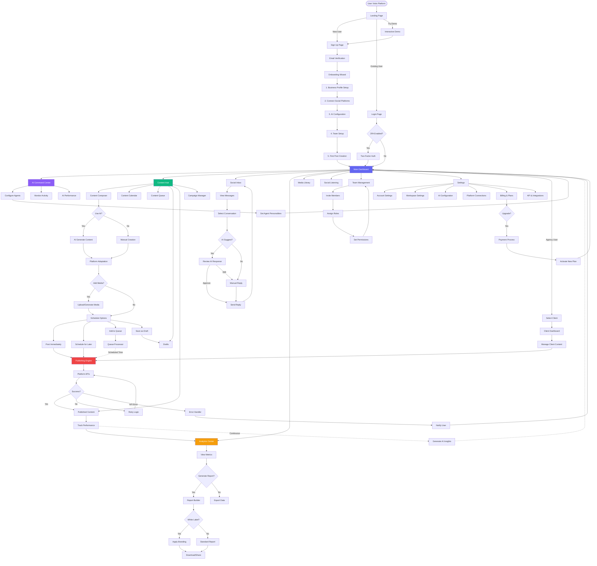
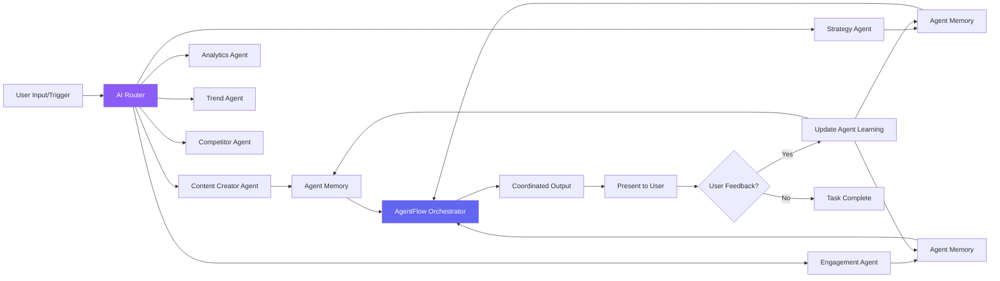
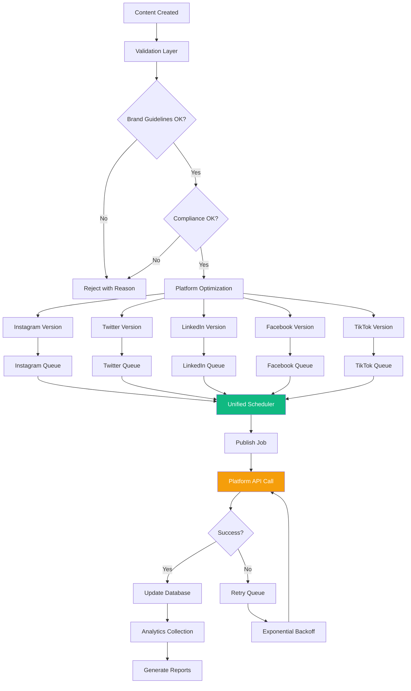
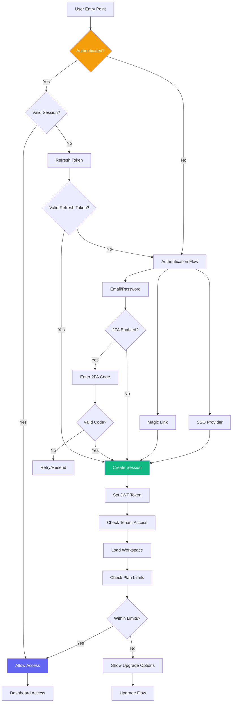
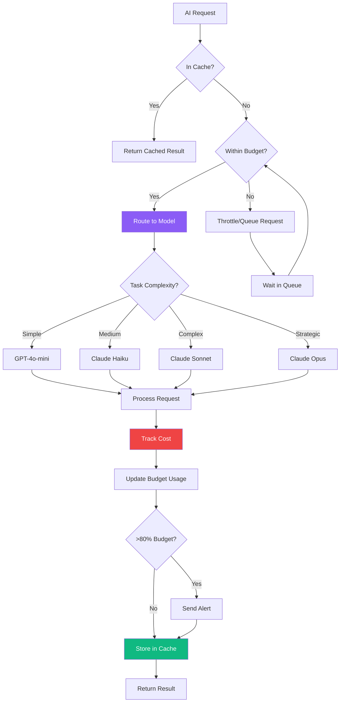
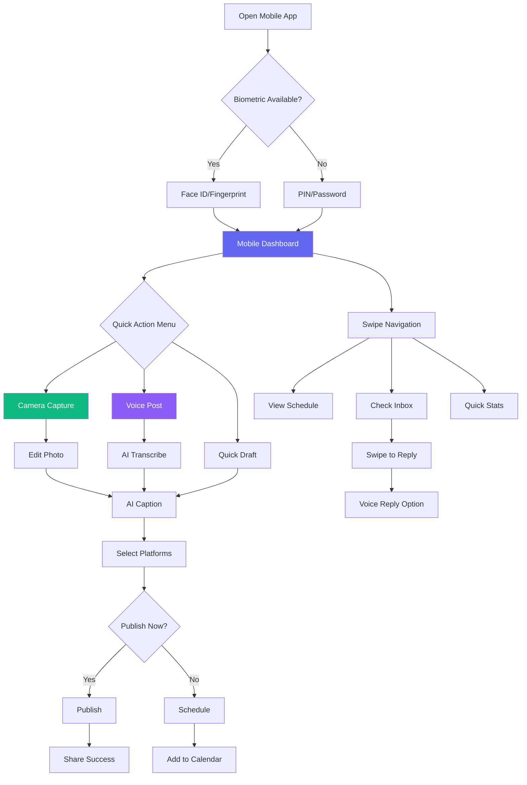
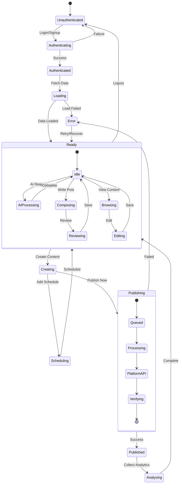

# AI Social Media Platform - User Flow Diagram

## Main User Flow Visualization



## Detailed Sub-Flows

### AI Agent Interaction Flow



### Content Publishing Pipeline



### User Authentication & Security Flow



### AI Cost Optimization Flow



### Mobile App User Journey



## State Management Flow



## Navigation Hierarchy

```
┌─────────────────────────────────────────────┐
│                  Platform Root              │
├─────────────────────────────────────────────┤
│                                             │
├── Public Pages                              │
│   ├── Landing (/)                           │
│   ├── Features (/features)                  │
│   ├── Pricing (/pricing)                    │
│   ├── Blog (/blog)                          │
│   └── Auth                                  │
│       ├── Login (/login)                    │
│       ├── Signup (/signup)                  │
│       └── Reset (/reset-password)           │
│                                             │
├── Authenticated App (/app)                  │
│   ├── Dashboard (/app/dashboard)            │
│   │   └── Widgets (customizable)            │
│   │                                         │
│   ├── AI Hub (/app/ai)                      │
│   │   ├── Agents (/app/ai/agents)           │
│   │   ├── Activity (/app/ai/activity)       │
│   │   └── Training (/app/ai/training)       │
│   │                                         │
│   ├── Content (/app/content)                │
│   │   ├── Composer (/app/content/compose)   │
│   │   ├── Calendar (/app/content/calendar)  │
│   │   ├── Queue (/app/content/queue)        │
│   │   ├── Drafts (/app/content/drafts)      │
│   │   ├── Published (/app/content/published)│
│   │   └── Campaigns (/app/content/campaigns)│
│   │                                         │
│   ├── Inbox (/app/inbox)                    │
│   │   ├── All (/app/inbox/all)              │
│   │   ├── Unread (/app/inbox/unread)        │
│   │   └── Priority (/app/inbox/priority)    │
│   │                                         │
│   ├── Analytics (/app/analytics)            │
│   │   ├── Overview (/app/analytics/overview)│
│   │   ├── Platforms (/app/analytics/platforms)│
│   │   ├── AI (/app/analytics/ai)            │
│   │   ├── Competitors (/app/analytics/competitors)│
│   │   └── Reports (/app/analytics/reports)  │
│   │                                         │
│   ├── Media (/app/media)                    │
│   │   └── Folders (dynamic)                 │
│   │                                         │
│   ├── Listening (/app/listening)            │
│   │                                         │
│   ├── Team (/app/team)                      │
│   │   ├── Members (/app/team/members)       │
│   │   ├── Permissions (/app/team/permissions)│
│   │   └── Activity (/app/team/activity)     │
│   │                                         │
│   ├── Settings (/app/settings)              │
│   │   ├── Account (/app/settings/account)   │
│   │   ├── Workspace (/app/settings/workspace)│
│   │   ├── AI (/app/settings/ai)             │
│   │   ├── Platforms (/app/settings/platforms)│
│   │   ├── Billing (/app/settings/billing)   │
│   │   └── API (/app/settings/api)           │
│   │                                         │
│   └── Agency (/app/agency) [Conditional]    │
│       ├── Clients (/app/agency/clients)     │
│       ├── Overview (/app/agency/overview)   │
│       └── Branding (/app/agency/branding)   │
│                                             │
└── System Pages                              │
    ├── 404 (/404)                            │
    ├── 500 (/500)                            │
    └── Maintenance (/maintenance)            │
```

## Component Architecture

```
                    ┌──────────────┐
                    │     App      │
                    │   Provider   │
                    └──────┬───────┘
                           │
                ┌──────────┴──────────┐
                │                     │
          ┌─────▼─────┐        ┌─────▼─────┐
          │   Auth    │        │   Theme   │
          │  Provider │        │  Provider │
          └─────┬─────┘        └─────┬─────┘
                │                     │
                └──────────┬──────────┘
                           │
                    ┌──────▼───────┐
                    │    Router    │
                    └──────┬───────┘
                           │
            ┌──────────────┼──────────────┐
            │              │              │
      ┌─────▼─────┐ ┌─────▼─────┐ ┌─────▼─────┐
      │   Layout  │ │   Pages   │ │  Modals   │
      │ Component │ │           │ │           │
      └─────┬─────┘ └─────┬─────┘ └─────┬─────┘
            │              │              │
    ┌───────┼───────┐      │      ┌──────┼──────┐
    │       │       │      │      │      │      │
┌───▼──┐ ┌─▼──┐ ┌──▼─┐ ┌──▼──┐ ┌─▼──┐ ┌─▼──┐ ┌─▼──┐
│Header│ │Nav │ │Main│ │Cards│ │Form│ │List│ │Chat│
└──────┘ └────┘ └────┘ └─────┘ └────┘ └────┘ └────┘
                           │
                    ┌──────┴───────┐
                    │   Shared     │
                    │  Components  │
                    └──────────────┘
                           │
        ┌──────────────────┼──────────────────┐
        │                  │                  │
  ┌─────▼─────┐     ┌─────▼─────┐     ┌─────▼─────┐
  │  Buttons  │     │   Inputs  │     │   Icons   │
  └───────────┘     └───────────┘     └───────────┘
```