# Design Document: Dashboard Redesign

## Overview

This design document outlines the architecture and implementation approach for the comprehensive dashboard redesign of the Agentic Social Media Platform. The dashboard will serve as a stunning, futuristic command center that combines the best design patterns from industry leaders (Buffer, Hootsuite, Sprout Social, Later, Planable) with a modern glassmorphism aesthetic, smooth animations, and powerful functionality.

### Design Goals
- **Visual Excellence**: Futuristic, cinematic, minimalistic design with glassmorphism effects
- **Performance**: Fast loading with skeleton states and optimistic updates
- **Accessibility**: WCAG AA compliant with reduced motion support
- **Responsiveness**: Seamless experience across mobile, tablet, and desktop
- **Feature-Rich**: Showcase all backend capabilities in an intuitive interface

## Architecture

```mermaid
graph TB
    subgraph "Dashboard Page"
        DP[DashboardPage Component]
    end

    subgraph "Layout Components"
        WH[WelcomeHero]
        QA[QuickActions]
        SG[StatsGrid]
    end

    subgraph "Feature Widgets"
        CP[ConnectedPlatforms]
        AA[AIAgentsStatus]
        RP[RecentPosts]
        PP[PlatformPerformance]
        AI[AIInsights]
        CC[ContentCalendar]
        TT[TrendingTopics]
        TA[TeamActivity]
    end

    subgraph "Visual Components"
        HS[HeroSection]
        VCF[VisualContentFeed]
        ACC[AICommandCenter]
        SI[SocialInbox]
        PQ[PublishingQueue]
        DV[DataVisualizations]
    end

    subgraph "Shared UI"
        MC[MetricCard]
        SC[StatusCard]
        AB[AnimatedBadge]
        GC[GlassCard]
        CT[Chart]
        SK[Skeleton]
    end

    subgraph "Hooks & State"
        UD[useDashboardData]
        UA[useAnalytics]
        UG[useAgents]
        UP[usePosts]
        UT[useTheme]
    end

    subgraph "API Layer"
        API[apiClient]
    end

    DP --> WH
    DP --> QA
    DP --> SG
    DP --> CP
    DP --> AA
    DP --> RP
    DP --> PP
    DP --> AI
    DP --> CC
    DP --> TT
    DP --> TA
    DP --> HS
    DP --> VCF
    DP --> ACC
    DP --> SI
    DP --> PQ
    DP --> DV

    WH --> GC
    SG --> MC
    CP --> SC
    AA --> AB
    PP --> CT
    DV --> CT

    DP --> UD
    UD --> UA
    UD --> UG
    UD --> UP
    UD --> API
```



## Components and Interfaces

### Core Dashboard Component

```typescript
// frontend/src/app/app/dashboard/page.tsx
interface DashboardPageProps {}

interface DashboardState {
  loading: boolean;
  error: string | null;
  analytics: AnalyticsData | null;
  socialAccounts: SocialAccount[];
  agents: Agent[];
  posts: Post[];
  aiUsage: AIUsageData | null;
  trends: TrendData[];
  teamActivity: TeamActivityItem[];
}
```

### Widget Components

```typescript
// WelcomeHero Component
interface WelcomeHeroProps {
  userName: string;
  planTier: string;
  notificationCount: number;
  quickActions: QuickAction[];
}

// StatsGrid Component
interface StatsGridProps {
  metrics: MetricData[];
  loading: boolean;
  onMetricClick: (metric: string) => void;
}

interface MetricData {
  id: string;
  label: string;
  value: number | string;
  change: number; // percentage change
  trend: 'up' | 'down' | 'neutral';
  icon: React.ComponentType;
  description: string;
}

// ConnectedPlatforms Component
interface ConnectedPlatformsProps {
  accounts: SocialAccount[];
  loading: boolean;
  onManageClick: () => void;
  onAccountClick: (accountId: string) => void;
}

interface SocialAccount {
  id: string;
  platform: SocialPlatform;
  displayName: string;
  username: string;
  status: 'active' | 'warning' | 'error' | 'disconnected';
  avatarUrl?: string;
  metadata?: Record<string, any>;
}

type SocialPlatform = 
  | 'twitter' 
  | 'instagram' 
  | 'linkedin' 
  | 'facebook' 
  | 'tiktok' 
  | 'youtube' 
  | 'pinterest' 
  | 'threads' 
  | 'reddit';

// AIAgentsStatus Component
interface AIAgentsStatusProps {
  agents: Agent[];
  statistics: AgentStatistics;
  loading: boolean;
  onAgentClick: (agentId: string) => void;
  onCreateAgent: () => void;
}

interface Agent {
  id: string;
  name: string;
  type: AgentType;
  active: boolean;
  tasksCompleted: number;
  lastRunAt?: string;
}

type AgentType = 
  | 'content_creator' 
  | 'strategy' 
  | 'engagement' 
  | 'analytics' 
  | 'trend_detection' 
  | 'competitor_analysis';

interface AgentStatistics {
  totalAgents: number;
  activeAgents: number;
  totalTasksCompleted: number;
}

// RecentPosts Component
interface RecentPostsProps {
  posts: Post[];
  loading: boolean;
  onPostClick: (postId: string) => void;
  onViewAll: () => void;
  onCreatePost: () => void;
}

interface Post {
  id: string;
  title: string;
  content: string;
  status: PostStatus;
  platforms: SocialPlatform[];
  scheduledAt?: string;
  publishedAt?: string;
  createdAt: string;
  mediaUrls?: string[];
  metrics?: PostMetrics;
}

type PostStatus = 'draft' | 'scheduled' | 'published' | 'failed' | 'cancelled';

interface PostMetrics {
  impressions: number;
  likes: number;
  comments: number;
  shares: number;
  engagementRate: number;
}

// PlatformPerformance Component
interface PlatformPerformanceProps {
  platformData: PlatformMetrics[];
  loading: boolean;
  onPlatformClick: (platform: SocialPlatform) => void;
}

interface PlatformMetrics {
  platform: SocialPlatform;
  impressions: number;
  engagement: number;
  engagementRate: number;
  postCount: number;
  isTopPerformer: boolean;
}

// AIInsights Component
interface AIInsightsProps {
  usage: AIUsageData | null;
  loading: boolean;
  onClick: () => void;
}

interface AIUsageData {
  totalRequests: number;
  tokensUsed: number;
  totalCost: number;
  budgetLimit: number;
  budgetUsedPercentage: number;
  requestsByType: Record<string, number>;
}

// ContentCalendar Component
interface ContentCalendarProps {
  posts: Post[];
  currentWeek: Date;
  onDayClick: (date: Date) => void;
  onViewFullCalendar: () => void;
}

// TrendingTopics Component
interface TrendingTopicsProps {
  trends: TrendData[];
  loading: boolean;
  onTrendClick: (trend: TrendData) => void;
}

interface TrendData {
  id: string;
  name: string;
  category: string;
  popularity: number; // 0-100
  hashtag?: string;
}

// TeamActivity Component
interface TeamActivityProps {
  activities: TeamActivityItem[];
  isTeamPlan: boolean;
  loading: boolean;
  onViewTeam: () => void;
}

interface TeamActivityItem {
  id: string;
  userId: string;
  userName: string;
  userAvatar?: string;
  action: string;
  target: string;
  timestamp: string;
}
```

### Visual Enhancement Components

```typescript
// HeroSection Component
interface HeroSectionProps {
  metrics: HeroMetric[];
  backgroundVariant: 'particles' | 'waves' | 'gradient';
}

interface HeroMetric {
  label: string;
  value: number;
  suffix?: string;
  animationDuration?: number;
}

// VisualContentFeed Component
interface VisualContentFeedProps {
  posts: Post[];
  layout: 'masonry' | 'grid';
  onPostHover: (postId: string) => void;
  onPostClick: (postId: string) => void;
  onLoadMore: () => void;
  hasMore: boolean;
}

// AICommandCenter Component
interface AICommandCenterProps {
  onSubmit: (prompt: string, type: AITaskType) => Promise<AIResponse>;
  suggestions: string[];
  quickActions: AIQuickAction[];
  isStreaming: boolean;
  streamedResponse: string;
}

type AITaskType = 'caption' | 'content' | 'image' | 'hashtags' | 'improve';

interface AIQuickAction {
  id: string;
  label: string;
  icon: React.ComponentType;
  type: AITaskType;
}

// SocialInbox Component
interface SocialInboxProps {
  items: InboxItem[];
  unreadCount: number;
  loading: boolean;
  onItemClick: (itemId: string) => void;
  onReply: (itemId: string, message: string) => void;
  onViewAll: () => void;
}

interface InboxItem {
  id: string;
  platform: SocialPlatform;
  type: 'message' | 'comment' | 'mention';
  senderName: string;
  senderAvatar?: string;
  preview: string;
  timestamp: string;
  isRead: boolean;
}

// PublishingQueue Component
interface PublishingQueueProps {
  posts: Post[];
  onReschedule: (postId: string, newTime: Date) => void;
  onPostClick: (postId: string) => void;
}

// DataVisualizations Component
interface DataVisualizationsProps {
  engagementData: TimeSeriesData[];
  platformComparison: PlatformMetrics[];
  chartType: 'line' | 'area' | 'bar';
  onChartClick: (dataPoint: any) => void;
}

interface TimeSeriesData {
  date: string;
  value: number;
  label?: string;
}
```

### Shared UI Components

```typescript
// GlassCard Component
interface GlassCardProps {
  children: React.ReactNode;
  variant: 'light' | 'dark' | 'accent';
  blur?: number;
  className?: string;
  onClick?: () => void;
  hoverable?: boolean;
}

// MetricCard Component
interface MetricCardProps {
  metric: MetricData;
  size: 'sm' | 'md' | 'lg';
  animated?: boolean;
  onClick?: () => void;
}

// AnimatedCounter Component
interface AnimatedCounterProps {
  value: number;
  duration?: number;
  prefix?: string;
  suffix?: string;
  decimals?: number;
}

// StatusBadge Component
interface StatusBadgeProps {
  status: 'active' | 'inactive' | 'warning' | 'error' | 'pending';
  label?: string;
  pulsing?: boolean;
  size?: 'sm' | 'md';
}

// SkeletonLoader Component
interface SkeletonLoaderProps {
  variant: 'card' | 'text' | 'avatar' | 'chart' | 'metric';
  count?: number;
  className?: string;
}
```

## Data Models

### API Response Types

```typescript
// Analytics Response
interface AnalyticsResponse {
  totalImpressions: number;
  totalEngagement: number;
  totalPosts: number;
  averageEngagementRate: number;
  topPosts: Post[];
  byPlatform: Record<SocialPlatform, PlatformMetrics>;
  timeline: TimeSeriesData[];
}

// Dashboard Data Response (aggregated)
interface DashboardDataResponse {
  analytics: AnalyticsResponse;
  socialAccounts: SocialAccount[];
  agents: Agent[];
  recentPosts: Post[];
  aiUsage: AIUsageData;
  trends: TrendData[];
  teamActivity: TeamActivityItem[];
  inbox: {
    items: InboxItem[];
    unreadCount: number;
  };
  calendar: {
    posts: Post[];
    week: string;
  };
}
```

### State Management

```typescript
// Dashboard Store (Zustand)
interface DashboardStore {
  // State
  data: DashboardDataResponse | null;
  loading: boolean;
  error: string | null;
  lastFetched: Date | null;
  
  // Actions
  fetchDashboardData: () => Promise<void>;
  refreshSection: (section: DashboardSection) => Promise<void>;
  setTheme: (theme: 'light' | 'dark') => void;
  
  // Computed
  getMetrics: () => MetricData[];
  getPlatformPerformance: () => PlatformMetrics[];
  getAgentStatistics: () => AgentStatistics;
}

type DashboardSection = 
  | 'analytics' 
  | 'accounts' 
  | 'agents' 
  | 'posts' 
  | 'aiUsage' 
  | 'trends' 
  | 'team' 
  | 'inbox';
```

## Correctness Properties

*A property is a characteristic or behavior that should hold true across all valid executions of a system-essentially, a formal statement about what the system should do. Properties serve as the bridge between human-readable specifications and machine-verifiable correctness guarantees.*

Based on the prework analysis, the following correctness properties have been identified:

### Property 1: Metrics Display Completeness
*For any* analytics data object, when rendered by the StatsGrid component, the output SHALL contain all four required metrics: total reach (impressions), engagement rate, total posts, and total engagement.
**Validates: Requirements 1.1**

### Property 2: Percentage Change Calculation
*For any* pair of current and previous period analytics values, the percentage change indicator SHALL be calculated as ((current - previous) / previous) * 100, rounded to one decimal place.
**Validates: Requirements 1.2**

### Property 3: Platform Account Rendering
*For any* list of social accounts, the ConnectedPlatforms component SHALL render each account with its platform icon, display name, and connection status visible.
**Validates: Requirements 2.1**

### Property 4: Active Account Status Badge
*For any* social account with status "active", the rendered output SHALL contain a green status indicator and the text "Active".
**Validates: Requirements 2.2**

### Property 5: Warning Account Status Badge
*For any* social account with token expiration issues (status "warning"), the rendered output SHALL contain a warning indicator and the text "Needs Attention".
**Validates: Requirements 2.3**

### Property 6: Agent Data Rendering
*For any* list of agents, the AIAgentsStatus component SHALL render each agent with its name, type, and active/inactive status visible.
**Validates: Requirements 3.1**

### Property 7: Active Agent Indicator
*For any* agent with active=true, the rendered output SHALL contain a green indicator element and "Active" status text.
**Validates: Requirements 3.2**

### Property 8: Inactive Agent Indicator
*For any* agent with active=false, the rendered output SHALL contain a gray indicator element and "Inactive" status text.
**Validates: Requirements 3.3**

### Property 9: Agent Statistics Calculation
*For any* list of agents, the statistics SHALL correctly calculate: totalAgents as the array length, activeAgents as the count where active=true, and totalTasksCompleted as the sum of all tasksCompleted values.
**Validates: Requirements 3.6**

### Property 10: Post Status Badge Mapping
*For any* post, the status badge color and text SHALL match: "published" → green/"Published", "scheduled" → blue/"Scheduled", "draft" → gray/"Draft", "failed" → red/"Failed".
**Validates: Requirements 4.2, 4.3, 4.4, 4.5**

### Property 11: Recent Posts Limit
*For any* list of posts passed to RecentPosts component, the rendered output SHALL display at most 5 posts.
**Validates: Requirements 4.1**

### Property 12: Platform Metrics Completeness
*For any* platform metrics object, the rendered output SHALL contain impressions, engagement count, engagement rate, and post count values.
**Validates: Requirements 5.2**

### Property 13: Top Performer Identification
*For any* set of platform metrics, exactly one platform (the one with the highest engagement rate) SHALL be marked with isTopPerformer=true.
**Validates: Requirements 5.3**

### Property 14: AI Budget Progress Calculation
*For any* AI usage data with budgetLimit > 0, the progress bar percentage SHALL equal (totalCost / budgetLimit) * 100, capped at 100.
**Validates: Requirements 7.2**

### Property 15: AI Budget Warning Threshold
*For any* AI usage data where budgetUsedPercentage >= 80, the rendered output SHALL contain a warning indicator element.
**Validates: Requirements 7.3**

### Property 16: Time-Based Greeting
*For any* hour value (0-23), the greeting SHALL be: hours 0-11 → "Good morning", hours 12-17 → "Good afternoon", hours 18-23 → "Good evening".
**Validates: Requirements 10.1**

### Property 17: Calendar Post Indicators
*For any* day in the calendar with scheduled posts, the rendered output SHALL display a dot indicator with the correct count of posts for that day.
**Validates: Requirements 8.2**

## Error Handling

### API Error Handling
```typescript
// Error types
type DashboardError = 
  | { type: 'network'; message: string }
  | { type: 'auth'; message: string }
  | { type: 'server'; message: string; statusCode: number }
  | { type: 'timeout'; message: string };

// Error handling strategy
const handleDashboardError = (error: DashboardError): void => {
  switch (error.type) {
    case 'network':
      // Show offline indicator, use cached data
      showToast('Network error. Showing cached data.', 'warning');
      break;
    case 'auth':
      // Redirect to login
      router.push('/login');
      break;
    case 'server':
      // Show error state with retry
      showToast('Server error. Please try again.', 'error');
      break;
    case 'timeout':
      // Show timeout message with retry
      showToast('Request timed out. Please try again.', 'warning');
      break;
  }
};
```

### Component Error Boundaries
Each major section will have its own error boundary to prevent cascading failures:
- Analytics section error → Show fallback with zero values
- Agents section error → Show empty state with retry
- Posts section error → Show empty state with retry
- Platform section error → Show connection prompt

### Graceful Degradation
- If analytics fails: Show zero values with "Data unavailable" message
- If agents fail: Show "Unable to load agents" with retry button
- If posts fail: Show "Unable to load posts" with retry button
- If AI usage fails: Hide AI insights card entirely

## Testing Strategy

### Dual Testing Approach

This feature will use both unit tests and property-based tests to ensure comprehensive coverage:

#### Unit Tests
- Component rendering tests for each widget
- Navigation tests for quick actions and links
- Empty state rendering tests
- Error state rendering tests
- Theme switching tests
- Responsive layout tests

#### Property-Based Tests
Property-based tests will be implemented using **fast-check** library for TypeScript/JavaScript. Each test will run a minimum of 100 iterations.

**Test File Structure:**
```
frontend/src/app/app/dashboard/
├── page.tsx
├── components/
│   ├── WelcomeHero.tsx
│   ├── StatsGrid.tsx
│   ├── ConnectedPlatforms.tsx
│   ├── AIAgentsStatus.tsx
│   ├── RecentPosts.tsx
│   ├── PlatformPerformance.tsx
│   ├── AIInsights.tsx
│   └── ...
├── hooks/
│   └── useDashboardData.ts
├── utils/
│   ├── calculations.ts
│   └── formatters.ts
└── __tests__/
    ├── dashboard.test.tsx
    ├── calculations.property.test.ts
    └── components.property.test.ts
```

**Property Test Format:**
Each property-based test will be tagged with a comment referencing the correctness property:
```typescript
// **Feature: dashboard-redesign, Property 2: Percentage Change Calculation**
test.prop([fc.integer(), fc.integer({ min: 1 })])(
  'percentage change is correctly calculated',
  (current, previous) => {
    const result = calculatePercentageChange(current, previous);
    const expected = ((current - previous) / previous) * 100;
    expect(result).toBeCloseTo(expected, 1);
  }
);
```

### Test Coverage Goals
- Unit test coverage: 80%+ for components
- Property tests: All 17 correctness properties covered
- Integration tests: Key user flows (navigation, data loading)
- Visual regression: Key components with Storybook

## Visual Design Specifications

### Color Palette
```css
/* Light Mode */
--bg-primary: #ffffff;
--bg-secondary: #f8fafc;
--bg-accent: #f0fdf4;
--text-primary: #0f172a;
--text-secondary: #64748b;
--accent-primary: #10b981; /* Emerald */
--accent-secondary: #3b82f6; /* Blue */

/* Dark Mode */
--bg-primary-dark: #0f172a;
--bg-secondary-dark: #1e293b;
--bg-accent-dark: #064e3b;
--text-primary-dark: #f8fafc;
--text-secondary-dark: #94a3b8;
--accent-primary-dark: #34d399;
--accent-secondary-dark: #60a5fa;

/* Glassmorphism */
--glass-bg: rgba(255, 255, 255, 0.1);
--glass-border: rgba(255, 255, 255, 0.2);
--glass-blur: 12px;
```

### Animation Specifications
```css
/* Timing Functions */
--ease-smooth: cubic-bezier(0.4, 0, 0.2, 1);
--ease-bounce: cubic-bezier(0.68, -0.55, 0.265, 1.55);

/* Durations */
--duration-fast: 150ms;
--duration-normal: 300ms;
--duration-slow: 500ms;

/* Stagger Delays */
--stagger-delay: 50ms;
```

### Responsive Breakpoints
```css
/* Mobile First */
--bp-sm: 640px;   /* Small tablets */
--bp-md: 768px;   /* Tablets */
--bp-lg: 1024px;  /* Small desktops */
--bp-xl: 1280px;  /* Large desktops */
--bp-2xl: 1536px; /* Extra large */
```
