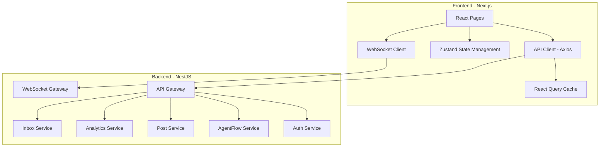
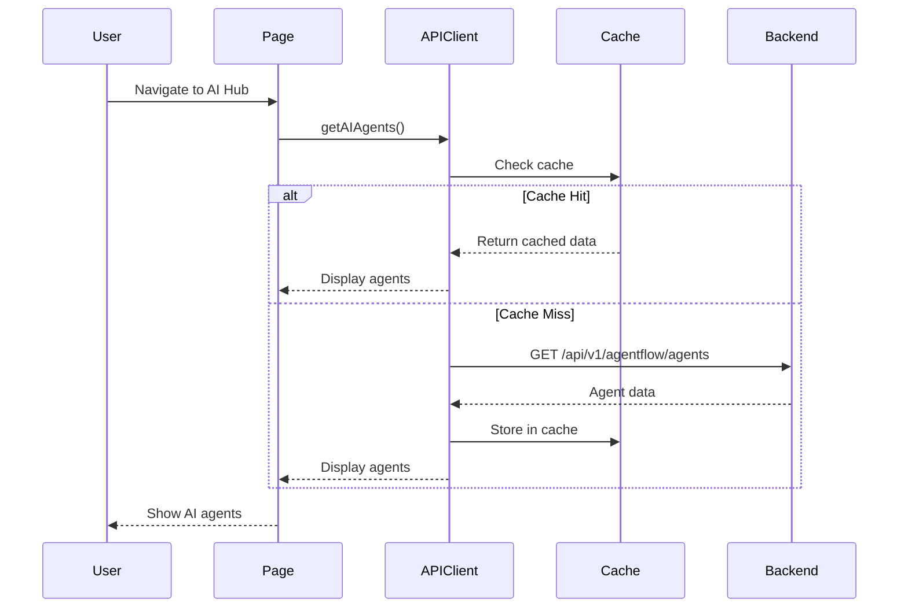

# Frontend-Backend Integration Design

## Overview

This design document outlines the integration architecture for connecting the Next.js frontend with the NestJS backend. The integration focuses on establishing robust API communication, real-time data synchronization, and seamless user experience across all platform features. The design leverages the existing API client infrastructure and extends it with proper error handling, caching strategies, and real-time capabilities.

## Architecture

### High-Level Integration Architecture



### Request Flow Architecture



## Components and Interfaces

### 1. Enhanced API Client

The existing API client will be extended with additional capabilities:

```typescript
// Enhanced API Client with React Query integration
class EnhancedApiClient extends ApiClient {
  // AgentFlow endpoints
  async getAgents(): Promise<Agent[]> {
    const response = await this.request<Agent[]>({
      method: 'GET',
      url: '/agentflow/agents',
    });
    return response.data || [];
  }

  async getAgentStatistics(): Promise<AgentStatistics> {
    const response = await this.request<AgentStatistics>({
      method: 'GET',
      url: '/agentflow/statistics',
    });
    return response.data!;
  }

  async activateAgent(agentId: string): Promise<void> {
    await this.request({
      method: 'POST',
      url: `/agentflow/agents/${agentId}/activate`,
    });
  }

  async deactivateAgent(agentId: string): Promise<void> {
    await this.request({
      method: 'POST',
      url: `/agentflow/agents/${agentId}/deactivate`,
    });
  }

  async getAgentActivity(): Promise<AgentActivity[]> {
    const response = await this.request<AgentActivity[]>({
      method: 'GET',
      url: '/agentflow/agents/activity',
    });
    return response.data || [];
  }

  // Analytics endpoints
  async getOverviewAnalytics(params: AnalyticsParams): Promise<OverviewAnalytics> {
    const response = await this.request<OverviewAnalytics>({
      method: 'GET',
      url: '/analytics/overview',
      params,
    });
    return response.data!;
  }

  async getAIInsights(): Promise<AIInsight[]> {
    const response = await this.request<AIInsight[]>({
      method: 'GET',
      url: '/ai/insights',
    });
    return response.data || [];
  }

  async getTrendAnalytics(params: TrendParams): Promise<TrendData> {
    const response = await this.request<TrendData>({
      method: 'GET',
      url: '/analytics/trends',
      params,
    });
    return response.data!;
  }
}
```

### 2. React Query Integration

Implement React Query for efficient data fetching and caching:

```typescript
// Custom hooks for data fetching
export function useAgents() {
  return useQuery({
    queryKey: ['agents'],
    queryFn: () => apiClient.getAgents(),
    staleTime: 30000, // 30 seconds
    refetchInterval: 30000, // Auto-refresh every 30 seconds
  });
}

export function useAgentStatistics() {
  return useQuery({
    queryKey: ['agent-statistics'],
    queryFn: () => apiClient.getAgentStatistics(),
    staleTime: 10000, // 10 seconds
  });
}

export function useAnalytics(params: AnalyticsParams) {
  return useQuery({
    queryKey: ['analytics', params],
    queryFn: () => apiClient.getOverviewAnalytics(params),
    staleTime: 60000, // 1 minute
  });
}

export function useAIInsights() {
  return useQuery({
    queryKey: ['ai-insights'],
    queryFn: () => apiClient.getAIInsights(),
    staleTime: 300000, // 5 minutes
  });
}

// Mutations for state-changing operations
export function useActivateAgent() {
  const queryClient = useQueryClient();
  
  return useMutation({
    mutationFn: (agentId: string) => apiClient.activateAgent(agentId),
    onSuccess: () => {
      // Invalidate and refetch agents
      queryClient.invalidateQueries({ queryKey: ['agents'] });
      queryClient.invalidateQueries({ queryKey: ['agent-statistics'] });
    },
  });
}
```

### 3. WebSocket Integration

Implement real-time updates using Socket.IO:

```typescript
// WebSocket client for real-time updates
class WebSocketClient {
  private socket: Socket | null = null;
  private reconnectAttempts = 0;
  private maxReconnectAttempts = 5;

  connect(token: string) {
    this.socket = io(process.env.NEXT_PUBLIC_WS_URL || 'http://localhost:3001', {
      auth: { token },
      transports: ['websocket'],
    });

    this.socket.on('connect', () => {
      console.log('WebSocket connected');
      this.reconnectAttempts = 0;
    });

    this.socket.on('disconnect', () => {
      console.log('WebSocket disconnected');
      this.handleReconnect();
    });

    // Agent events
    this.socket.on('agent:task:completed', (data: AgentTaskEvent) => {
      this.handleAgentTaskCompleted(data);
    });

    this.socket.on('agent:status:changed', (data: AgentStatusEvent) => {
      this.handleAgentStatusChanged(data);
    });

    // Inbox events
    this.socket.on('inbox:message:new', (data: NewMessageEvent) => {
      this.handleNewMessage(data);
    });

    // Post events
    this.socket.on('post:published', (data: PostPublishedEvent) => {
      this.handlePostPublished(data);
    });
  }

  private handleReconnect() {
    if (this.reconnectAttempts < this.maxReconnectAttempts) {
      this.reconnectAttempts++;
      const delay = Math.min(1000 * Math.pow(2, this.reconnectAttempts), 30000);
      setTimeout(() => this.socket?.connect(), delay);
    }
  }

  private handleAgentTaskCompleted(data: AgentTaskEvent) {
    // Update React Query cache
    queryClient.invalidateQueries({ queryKey: ['agents'] });
    queryClient.invalidateQueries({ queryKey: ['agent-statistics'] });
    
    // Show notification
    toast.success(`${data.agentName} completed: ${data.taskDescription}`);
  }

  private handleNewMessage(data: NewMessageEvent) {
    // Update inbox cache
    queryClient.invalidateQueries({ queryKey: ['conversations'] });
    
    // Show notification
    toast.info(`New message from ${data.platform}: ${data.preview}`);
  }

  disconnect() {
    this.socket?.disconnect();
    this.socket = null;
  }
}
```

### 4. State Management with Zustand

Enhance state management for UI state and real-time updates:

```typescript
// Enhanced auth store
interface AuthStore {
  user: User | null;
  token: string | null;
  isAuthenticated: boolean;
  login: (credentials: LoginCredentials) => Promise<void>;
  logout: () => void;
  refreshToken: () => Promise<void>;
}

export const useAuthStore = create<AuthStore>((set, get) => ({
  user: null,
  token: null,
  isAuthenticated: false,

  login: async (credentials) => {
    const response = await apiClient.login(credentials);
    set({
      user: response.user,
      token: response.access_token,
      isAuthenticated: true,
    });
    
    // Connect WebSocket
    wsClient.connect(response.access_token);
  },

  logout: () => {
    apiClient.logout();
    wsClient.disconnect();
    set({
      user: null,
      token: null,
      isAuthenticated: false,
    });
  },

  refreshToken: async () => {
    try {
      const response = await apiClient.refreshToken();
      set({ token: response.access_token });
    } catch (error) {
      // Token refresh failed, logout user
      get().logout();
    }
  },
}));

// Real-time notifications store
interface NotificationStore {
  notifications: Notification[];
  unreadCount: number;
  addNotification: (notification: Notification) => void;
  markAsRead: (id: string) => void;
  clearAll: () => void;
}

export const useNotificationStore = create<NotificationStore>((set) => ({
  notifications: [],
  unreadCount: 0,

  addNotification: (notification) => set((state) => ({
    notifications: [notification, ...state.notifications],
    unreadCount: state.unreadCount + 1,
  })),

  markAsRead: (id) => set((state) => ({
    notifications: state.notifications.map((n) =>
      n.id === id ? { ...n, read: true } : n
    ),
    unreadCount: Math.max(0, state.unreadCount - 1),
  })),

  clearAll: () => set({ notifications: [], unreadCount: 0 }),
}));
```

## Data Models

### Frontend Type Definitions

```typescript
// Agent types
interface Agent {
  id: string;
  tenantId: string;
  name: string;
  type: AgentType;
  active: boolean;
  model: string;
  personalityConfig: Record<string, any>;
  usageStats: {
    totalTasks: number;
    successRate: number;
    totalCost: number;
    avgResponseTime: number;
  };
  metadata: {
    lastAction?: string;
    lastActionTime?: string;
  };
  createdAt: string;
}

type AgentType = 
  | 'content_creator'
  | 'strategy'
  | 'engagement'
  | 'analytics'
  | 'trend_detection'
  | 'competitor_analysis';

interface AgentStatistics {
  totalCost: number;
  totalTasks: number;
  avgResponseTime: number;
  successRate: number;
  activeAgents: number;
  costByAgent: Record<string, number>;
  tasksByAgent: Record<string, number>;
}

interface AgentActivity {
  id: string;
  agentId: string;
  agentName: string;
  action: string;
  status: 'completed' | 'failed' | 'in_progress';
  timestamp: string;
  metadata: Record<string, any>;
}

// Analytics types
interface OverviewAnalytics {
  totalReach: number;
  totalEngagement: number;
  totalFollowers: number;
  reachChange: number;
  engagementChange: number;
  followersChange: number;
  topPosts: Post[];
  platformBreakdown: PlatformMetrics[];
}

interface AIInsight {
  id: string;
  type: 'performance' | 'timing' | 'content' | 'audience';
  title: string;
  description: string;
  confidence: number;
  actionable: boolean;
  createdAt: string;
}

// Post types
interface Post {
  id: string;
  tenantId: string;
  userId: string;
  content: string;
  mediaUrls: string[];
  scheduledTime: string | null;
  status: 'draft' | 'scheduled' | 'published' | 'failed';
  aiGenerated: boolean;
  agentId: string | null;
  platformAdaptations: Record<string, PlatformContent>;
  createdAt: string;
  updatedAt: string;
}

interface PlatformContent {
  platform: string;
  content: string;
  hashtags: string[];
  mentions: string[];
}

// Inbox types
interface Conversation {
  id: string;
  platform: string;
  accountId: string;
  participantName: string;
  participantHandle: string;
  lastMessage: Message;
  unreadCount: number;
  sentiment: 'positive' | 'neutral' | 'negative';
  priority: 'high' | 'medium' | 'low';
  assignedTo: string | null;
  status: 'open' | 'closed' | 'pending';
  createdAt: string;
  updatedAt: string;
}

interface Message {
  id: string;
  conversationId: string;
  content: string;
  sender: 'user' | 'customer';
  platform: string;
  timestamp: string;
  metadata: Record<string, any>;
}
```

## Error Handling

### Comprehensive Error Handling Strategy

```typescript
// Error types
enum ErrorType {
  NETWORK_ERROR = 'NETWORK_ERROR',
  AUTH_ERROR = 'AUTH_ERROR',
  VALIDATION_ERROR = 'VALIDATION_ERROR',
  RATE_LIMIT_ERROR = 'RATE_LIMIT_ERROR',
  SERVER_ERROR = 'SERVER_ERROR',
  NOT_FOUND_ERROR = 'NOT_FOUND_ERROR',
}

class APIError extends Error {
  constructor(
    public type: ErrorType,
    public message: string,
    public statusCode?: number,
    public retryAfter?: number
  ) {
    super(message);
  }
}

// Enhanced error handler in API client
private handleError(error: any): never {
  if (error.response) {
    const { status, data } = error.response;
    
    switch (status) {
      case 401:
        this.clearAuth();
        if (typeof window !== 'undefined') {
          window.location.href = '/login';
        }
        throw new APIError(
          ErrorType.AUTH_ERROR,
          'Your session has expired. Please log in again.',
          401
        );
      
      case 403:
        toast.error('Access denied. You don\'t have permission to perform this action.');
        throw new APIError(
          ErrorType.AUTH_ERROR,
          'Access denied',
          403
        );
      
      case 404:
        toast.error('Resource not found.');
        throw new APIError(
          ErrorType.NOT_FOUND_ERROR,
          'Resource not found',
          404
        );
      
      case 429:
        const retryAfter = parseInt(error.response.headers['retry-after'] || '60');
        toast.error(`Rate limit exceeded. Please try again in ${retryAfter} seconds.`);
        throw new APIError(
          ErrorType.RATE_LIMIT_ERROR,
          'Rate limit exceeded',
          429,
          retryAfter
        );
      
      case 500:
      case 502:
      case 503:
        toast.error('Server error. Our team has been notified. Please try again later.');
        throw new APIError(
          ErrorType.SERVER_ERROR,
          data?.message || 'Server error',
          status
        );
      
      default:
        toast.error(data?.message || 'An unexpected error occurred.');
        throw new APIError(
          ErrorType.SERVER_ERROR,
          data?.message || 'Unknown error',
          status
        );
    }
  } else if (error.request) {
    toast.error('Network error. Please check your connection and try again.');
    throw new APIError(
      ErrorType.NETWORK_ERROR,
      'Network error. Please check your connection.'
    );
  } else {
    toast.error('An unexpected error occurred.');
    throw new APIError(
      ErrorType.SERVER_ERROR,
      error.message || 'Unknown error'
    );
  }
}

// React Query error handling
const queryClient = new QueryClient({
  defaultOptions: {
    queries: {
      retry: (failureCount, error) => {
        // Don't retry on auth errors
        if (error instanceof APIError && error.type === ErrorType.AUTH_ERROR) {
          return false;
        }
        // Retry up to 3 times for other errors
        return failureCount < 3;
      },
      retryDelay: (attemptIndex) => Math.min(1000 * 2 ** attemptIndex, 30000),
    },
    mutations: {
      retry: false, // Don't retry mutations by default
    },
  },
});
```

## Testing Strategy

### Unit Testing

Test individual API client methods and hooks:

```typescript
describe('API Client - AgentFlow', () => {
  it('should fetch agents successfully', async () => {
    const mockAgents = [
      { id: '1', name: 'Content Creator', type: 'content_creator', active: true },
      { id: '2', name: 'Strategy Agent', type: 'strategy', active: true },
    ];
    
    mock.onGet('/agentflow/agents').reply(200, {
      success: true,
      data: mockAgents,
    });
    
    const agents = await apiClient.getAgents();
    expect(agents).toEqual(mockAgents);
  });

  it('should handle agent activation', async () => {
    mock.onPost('/agentflow/agents/1/activate').reply(200, {
      success: true,
    });
    
    await expect(apiClient.activateAgent('1')).resolves.not.toThrow();
  });

  it('should handle errors gracefully', async () => {
    mock.onGet('/agentflow/agents').reply(500);
    
    await expect(apiClient.getAgents()).rejects.toThrow(APIError);
  });
});

describe('useAgents hook', () => {
  it('should fetch and cache agents', async () => {
    const { result, waitFor } = renderHook(() => useAgents(), {
      wrapper: createQueryWrapper(),
    });
    
    await waitFor(() => result.current.isSuccess);
    
    expect(result.current.data).toBeDefined();
    expect(result.current.data?.length).toBeGreaterThan(0);
  });
});
```

### Integration Testing

Test complete user flows:

```typescript
describe('AI Hub Integration', () => {
  it('should load agents and display them', async () => {
    render(<AIHubPage />, { wrapper: AppWrapper });
    
    // Wait for agents to load
    await waitFor(() => {
      expect(screen.getByText('Content Creator')).toBeInTheDocument();
    });
    
    // Verify agent cards are displayed
    expect(screen.getAllByRole('article')).toHaveLength(6);
  });

  it('should toggle agent status', async () => {
    render(<AIHubPage />, { wrapper: AppWrapper });
    
    await waitFor(() => {
      expect(screen.getByText('Content Creator')).toBeInTheDocument();
    });
    
    // Click activate/deactivate button
    const toggleButton = screen.getAllByRole('button', { name: /pause|play/i })[0];
    fireEvent.click(toggleButton);
    
    // Verify API was called
    await waitFor(() => {
      expect(mockApiClient.activateAgent).toHaveBeenCalled();
    });
    
    // Verify UI updated
    expect(screen.getByText(/activated/i)).toBeInTheDocument();
  });
});
```

### End-to-End Testing

Test complete workflows with Playwright:

```typescript
test('User can view and manage AI agents', async ({ page }) => {
  // Login
  await page.goto('/login');
  await page.fill('[name="email"]', 'test@example.com');
  await page.fill('[name="password"]', 'password123');
  await page.click('button[type="submit"]');
  
  // Navigate to AI Hub
  await page.click('text=AI Hub');
  await page.waitForURL('**/app/ai-hub');
  
  // Verify agents are loaded
  await expect(page.locator('text=Content Creator')).toBeVisible();
  await expect(page.locator('text=Strategy Agent')).toBeVisible();
  
  // Toggle agent status
  await page.click('[data-testid="agent-toggle-1"]');
  await expect(page.locator('text=Agent activated')).toBeVisible();
  
  // Verify statistics updated
  await expect(page.locator('[data-testid="active-agents-count"]')).toContainText('6');
});
```

## Correctness Properties

*A property is a characteristic or behavior that should hold true across all valid executions of a system-essentially, a formal statement about what the system should do. Properties serve as the bridge between human-readable specifications and machine-verifiable correctness guarantees.*

### Property 1: API Response Consistency

*For any* API endpoint, when called with valid authentication and parameters, the response structure should match the defined TypeScript interface
**Validates: Requirements 1.1, 2.1, 3.1, 4.1, 5.1, 6.1, 7.1**

### Property 2: Authentication State Consistency

*For any* authenticated request, if the JWT token is valid, the request should succeed; if the token is expired or invalid, the system should redirect to login
**Validates: Requirements 10.1, 10.2, 10.3, 10.4, 10.5**

### Property 3: Cache Invalidation Correctness

*For any* mutation operation (create, update, delete), the related query caches should be invalidated and refetched to maintain data consistency
**Validates: Requirements 1.3, 3.2, 5.4, 6.3, 7.3**

### Property 4: Real-Time Update Propagation

*For any* WebSocket event received, the corresponding UI state should update within 1 second without requiring manual refresh
**Validates: Requirements 8.1, 8.2, 8.3, 8.4**

### Property 5: Error Handling Completeness

*For any* API error response, the system should display an appropriate user-facing message and handle the error gracefully without crashing
**Validates: Requirements 9.1, 9.2, 9.3, 9.4, 9.5**

### Property 6: Data Transformation Correctness

*For any* data fetched from the backend, the transformation to frontend types should preserve all required fields and maintain type safety
**Validates: Requirements 1.2, 2.2, 3.5, 4.2**

### Property 7: Optimistic Update Rollback

*For any* optimistic UI update, if the backend operation fails, the UI should revert to the previous state and display an error message
**Validates: Requirements 1.3, 3.2, 6.3**

### Property 8: Pagination Consistency

*For any* paginated endpoint, fetching subsequent pages should not duplicate or skip items from previous pages
**Validates: Requirements 6.1, 7.1**

## Performance Optimization

### Caching Strategy

```typescript
// React Query cache configuration
const queryClient = new QueryClient({
  defaultOptions: {
    queries: {
      // Agents - refresh every 30 seconds
      staleTime: 30000,
      cacheTime: 300000, // Keep in cache for 5 minutes
      
      // Analytics - refresh every minute
      staleTime: 60000,
      cacheTime: 600000, // Keep in cache for 10 minutes
      
      // AI Insights - refresh every 5 minutes
      staleTime: 300000,
      cacheTime: 1800000, // Keep in cache for 30 minutes
    },
  },
});

// Prefetch strategies
export function prefetchDashboardData() {
  const queryClient = useQueryClient();
  
  // Prefetch all dashboard data on login
  queryClient.prefetchQuery({
    queryKey: ['agents'],
    queryFn: () => apiClient.getAgents(),
  });
  
  queryClient.prefetchQuery({
    queryKey: ['analytics', { period: 'today' }],
    queryFn: () => apiClient.getOverviewAnalytics({ period: 'today' }),
  });
  
  queryClient.prefetchQuery({
    queryKey: ['ai-insights'],
    queryFn: () => apiClient.getAIInsights(),
  });
}
```

### Request Batching

```typescript
// Batch multiple requests into a single API call
class BatchRequestManager {
  private queue: Map<string, Promise<any>> = new Map();
  private batchTimeout: NodeJS.Timeout | null = null;

  async batchRequest<T>(key: string, requestFn: () => Promise<T>): Promise<T> {
    // If request is already queued, return existing promise
    if (this.queue.has(key)) {
      return this.queue.get(key)!;
    }

    // Queue the request
    const promise = requestFn();
    this.queue.set(key, promise);

    // Schedule batch execution
    if (!this.batchTimeout) {
      this.batchTimeout = setTimeout(() => this.executeBatch(), 50);
    }

    return promise;
  }

  private async executeBatch() {
    const requests = Array.from(this.queue.entries());
    this.queue.clear();
    this.batchTimeout = null;

    // Execute all requests in parallel
    await Promise.all(requests.map(([_, promise]) => promise));
  }
}
```

## Security Considerations

### Token Management

```typescript
// Secure token storage and refresh
class TokenManager {
  private refreshPromise: Promise<string> | null = null;

  async getValidToken(): Promise<string> {
    const token = localStorage.getItem('auth_token');
    const expiresAt = localStorage.getItem('token_expires_at');

    if (!token || !expiresAt) {
      throw new Error('No authentication token');
    }

    // Check if token is about to expire (within 5 minutes)
    const expiresIn = parseInt(expiresAt) - Date.now();
    if (expiresIn < 300000) {
      return this.refreshToken();
    }

    return token;
  }

  private async refreshToken(): Promise<string> {
    // Prevent multiple simultaneous refresh requests
    if (this.refreshPromise) {
      return this.refreshPromise;
    }

    this.refreshPromise = (async () => {
      try {
        const response = await apiClient.refreshToken();
        localStorage.setItem('auth_token', response.access_token);
        localStorage.setItem('token_expires_at', String(Date.now() + 3600000));
        return response.access_token;
      } finally {
        this.refreshPromise = null;
      }
    })();

    return this.refreshPromise;
  }
}
```

### XSS Protection

```typescript
// Sanitize user-generated content
import DOMPurify from 'dompurify';

function sanitizeContent(content: string): string {
  return DOMPurify.sanitize(content, {
    ALLOWED_TAGS: ['b', 'i', 'em', 'strong', 'a', 'p', 'br'],
    ALLOWED_ATTR: ['href', 'target'],
  });
}

// Use in components
function PostContent({ content }: { content: string }) {
  return (
    <div
      dangerouslySetInnerHTML={{ __html: sanitizeContent(content) }}
    />
  );
}
```
