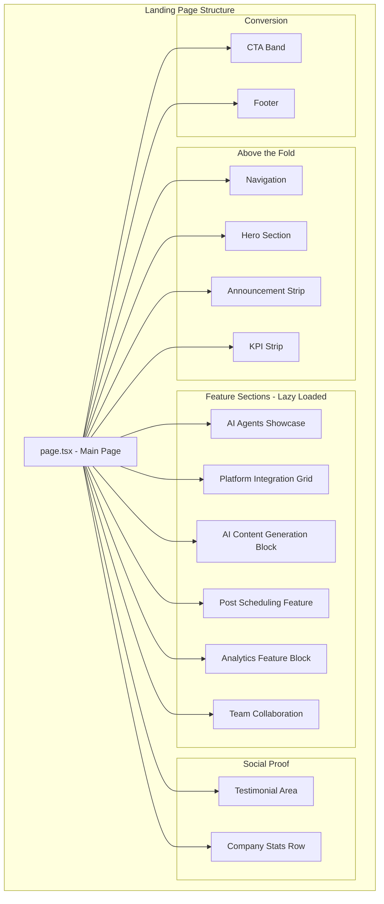
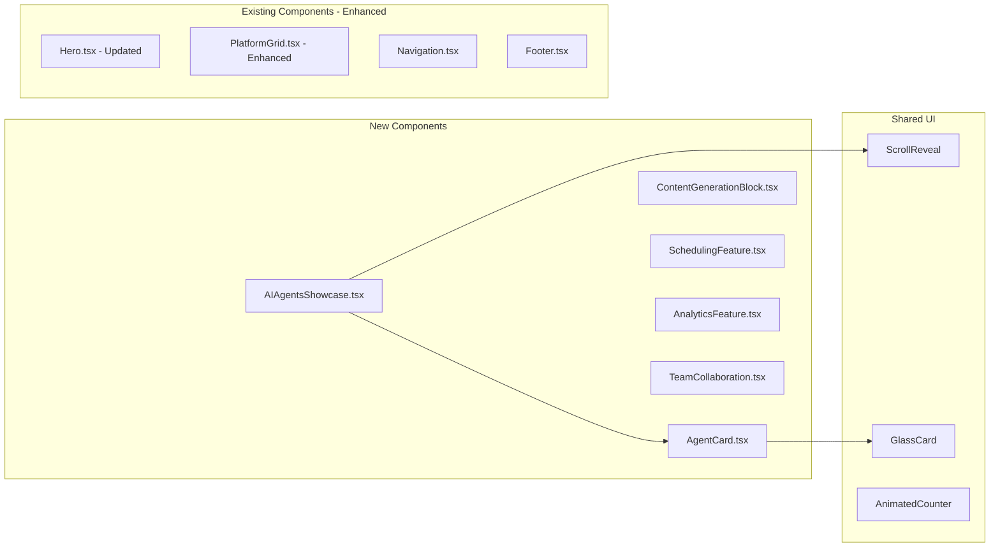

# Design Document: Landing Page Feature Showcase

## Overview

This design document outlines the architecture and implementation approach for redesigning the landing page of the Agentic Social Media Platform. The redesigned page will effectively showcase all backend features including the multi-agent AI system, 9-platform integration, AI content generation, post scheduling, analytics, and team collaboration capabilities.

The landing page will be built using Next.js with React components, leveraging the existing design system (Tailwind CSS, Lucide icons) and component library. The page will follow a modular architecture with lazy-loaded sections for optimal performance.

## Architecture



### Component Hierarchy



## Components and Interfaces

### New Components

#### 1. AIAgentsShowcase Component

```typescript
// frontend/src/components/landing/AIAgentsShowcase.tsx

interface AIAgent {
  id: string;
  name: string;
  type: AgentType;
  description: string;
  icon: React.ReactNode;
  capabilities: string[];
  color: string;
}

interface AIAgentsShowcaseProps {
  agents: AIAgent[];
}

// AgentType enum matching backend
type AgentType = 
  | 'content_creator'
  | 'strategy'
  | 'engagement'
  | 'analytics'
  | 'trend_detection'
  | 'competitor_analysis';
```

#### 2. ContentGenerationBlock Component

```typescript
// frontend/src/components/landing/ContentGenerationBlock.tsx

interface ContentType {
  id: string;
  title: string;
  description: string;
  icon: React.ReactNode;
  aiModel: string; // 'GPT-4' | 'Claude' | 'DALL-E'
  example?: string;
}

interface ContentGenerationBlockProps {
  contentTypes: ContentType[];
  ctaText: string;
  ctaLink: string;
}
```

#### 3. SchedulingFeature Component

```typescript
// frontend/src/components/landing/SchedulingFeature.tsx

interface SchedulingFeatureProps {
  title: string;
  description: string;
  features: string[];
  calendarImage: string;
  publishingOptions: Array<{
    type: 'draft' | 'scheduled' | 'immediate';
    label: string;
    description: string;
  }>;
}
```

#### 4. AnalyticsFeature Component

```typescript
// frontend/src/components/landing/AnalyticsFeature.tsx

interface MetricType {
  name: string;
  icon: React.ReactNode;
  description: string;
}

interface AnalyticsFeatureProps {
  title: string;
  description: string;
  metrics: MetricType[];
  dashboardImage: string;
  highlights: string[];
}
```

#### 5. TeamCollaboration Component

```typescript
// frontend/src/components/landing/TeamCollaboration.tsx

interface Role {
  name: string;
  permissions: string[];
  icon: React.ReactNode;
}

interface TeamCollaborationProps {
  title: string;
  description: string;
  roles: Role[];
  features: string[];
  teamImage: string;
}
```

### Updated Landing Content Structure

```typescript
// frontend/src/lib/landing-content.tsx - Extended

interface LandingPageContent {
  // Existing
  hero: HeroContent;
  announcement: AnnouncementContent;
  kpis: KPIContent[];
  features: FeaturesContent;
  platforms: PlatformContent[];
  testimonials: TestimonialContent[];
  customerSupport: CustomerSupportContent;
  resources: ResourceContent[];
  companyStats: CompanyStatContent[];
  cta: CTAContent;
  footer: FooterContent;
  
  // New sections
  aiAgents: AIAgent[];
  contentGeneration: ContentGenerationContent;
  scheduling: SchedulingContent;
  analytics: AnalyticsContent;
  teamCollaboration: TeamCollaborationContent;
}
```

## Data Models

### AI Agents Data

```typescript
const AI_AGENTS: AIAgent[] = [
  {
    id: 'content-creator',
    name: 'Content Creator',
    type: 'content_creator',
    description: 'Generates engaging posts, captions, and hashtags tailored to your brand voice',
    icon: <PenTool />,
    capabilities: ['Post generation', 'Caption writing', 'Hashtag suggestions', 'Content variations'],
    color: '#FF6B6B'
  },
  {
    id: 'strategy',
    name: 'Strategy Agent',
    type: 'strategy',
    description: 'Develops data-driven content strategies and optimal posting schedules',
    icon: <Target />,
    capabilities: ['Content planning', 'Posting schedule', 'Audience targeting', 'Campaign strategy'],
    color: '#4ECDC4'
  },
  {
    id: 'engagement',
    name: 'Engagement Agent',
    type: 'engagement',
    description: 'Monitors and responds to audience interactions to boost engagement',
    icon: <MessageSquare />,
    capabilities: ['Comment responses', 'DM management', 'Engagement tracking', 'Community building'],
    color: '#45B7D1'
  },
  {
    id: 'analytics',
    name: 'Analytics Agent',
    type: 'analytics',
    description: 'Analyzes performance metrics and provides actionable insights',
    icon: <BarChart3 />,
    capabilities: ['Performance reports', 'Trend analysis', 'ROI tracking', 'Competitor benchmarking'],
    color: '#96CEB4'
  },
  {
    id: 'trend-detection',
    name: 'Trend Detection',
    type: 'trend_detection',
    description: 'Identifies trending topics and viral content opportunities',
    icon: <TrendingUp />,
    capabilities: ['Trend monitoring', 'Viral prediction', 'Topic suggestions', 'Timing optimization'],
    color: '#FFEAA7'
  },
  {
    id: 'competitor-analysis',
    name: 'Competitor Analysis',
    type: 'competitor_analysis',
    description: 'Tracks competitor activity and identifies market opportunities',
    icon: <Eye />,
    capabilities: ['Competitor tracking', 'Market analysis', 'Gap identification', 'Benchmarking'],
    color: '#DDA0DD'
  }
];
```

### Platform Integration Data

```typescript
const SUPPORTED_PLATFORMS = [
  { id: 'twitter', name: 'Twitter/X', icon: <Twitter /> },
  { id: 'facebook', name: 'Facebook', icon: <Facebook /> },
  { id: 'instagram', name: 'Instagram', icon: <Instagram /> },
  { id: 'linkedin', name: 'LinkedIn', icon: <Linkedin /> },
  { id: 'youtube', name: 'YouTube', icon: <Youtube /> },
  { id: 'tiktok', name: 'TikTok', icon: <TikTokIcon /> },
  { id: 'pinterest', name: 'Pinterest', icon: <PinterestIcon /> },
  { id: 'threads', name: 'Threads', icon: <ThreadsIcon /> },
  { id: 'reddit', name: 'Reddit', icon: <RedditIcon /> }
];
```

### Content Generation Types

```typescript
const CONTENT_GENERATION_TYPES: ContentType[] = [
  {
    id: 'captions',
    title: 'Smart Captions',
    description: 'AI-generated captions optimized for each platform',
    icon: <Type />,
    aiModel: 'GPT-4'
  },
  {
    id: 'content',
    title: 'Long-form Content',
    description: 'Articles, threads, and detailed posts',
    icon: <FileText />,
    aiModel: 'Claude'
  },
  {
    id: 'images',
    title: 'AI Images',
    description: 'Generate unique visuals for your posts',
    icon: <Image />,
    aiModel: 'DALL-E 3'
  },
  {
    id: 'hashtags',
    title: 'Hashtag Generator',
    description: 'Trending and relevant hashtags',
    icon: <Hash />,
    aiModel: 'GPT-4'
  }
];
```

## Correctness Properties

*A property is a characteristic or behavior that should hold true across all valid executions of a system-essentially, a formal statement about what the system should do. Properties serve as the bridge between human-readable specifications and machine-verifiable correctness guarantees.*

Based on the prework analysis, the following correctness properties have been identified:

### Property 1: Agent cards contain required content and count is exactly 6

*For any* rendering of the AI Agents Showcase section, there SHALL be exactly 6 agent cards, and each card SHALL contain a name (non-empty string), description (non-empty string), and icon element.

**Validates: Requirements 2.1, 2.2**

### Property 2: Platform icons have accessible names and count is exactly 9

*For any* rendering of the Platform Integration section, there SHALL be exactly 9 platform elements, and each element SHALL have an accessible name (via aria-label, title, or visible text).

**Validates: Requirements 3.1, 3.3**

### Property 3: Testimonials contain required content and count is at least 3

*For any* rendering of the Testimonials section, there SHALL be at least 3 testimonial elements, and each testimonial SHALL contain a quote (non-empty string), author name (non-empty string), and author role (non-empty string).

**Validates: Requirements 7.1**

### Property 4: Navigation contains required links

*For any* rendering of the Navigation component, it SHALL contain links to Features, Channels, Pricing, Login, and Signup pages with valid href attributes.

**Validates: Requirements 11.1**

### Property 5: Footer contains required sections

*For any* rendering of the Footer component, it SHALL contain exactly 4 link sections (Product, Company, Resources, Legal), and each section SHALL have a title and at least one link.

**Validates: Requirements 11.3**

### Property 6: Responsive layout adapts at breakpoints

*For any* viewport width, the Landing Page layout SHALL adapt appropriately: single-column for mobile (< 768px), adjusted layout for tablet (768px - 1024px), and full layout for desktop (> 1024px).

**Validates: Requirements 10.1, 10.2**

### Property 7: Content generation section displays exactly 4 types

*For any* rendering of the Content Generation Block, there SHALL be exactly 4 content type elements representing Captions, Long-form Content, Images, and Hashtags.

**Validates: Requirements 4.1**

## Error Handling

### Component Error Boundaries

Each major section will be wrapped in an error boundary to prevent cascading failures:

```typescript
<PageSectionBoundary sectionName="AI Agents">
  <AIAgentsShowcase agents={landingContent.aiAgents} />
</PageSectionBoundary>
```

### Image Loading Fallbacks

- Use Next.js Image component with blur placeholder
- Provide fallback images for failed loads
- Implement skeleton loaders during image loading

### Data Validation

- Validate landing content data at build time
- Provide TypeScript strict typing for all content interfaces
- Use default values for optional content fields

## Testing Strategy

### Dual Testing Approach

This implementation will use both unit tests and property-based tests:

1. **Unit Tests**: Verify specific examples and edge cases using Jest and React Testing Library
2. **Property-Based Tests**: Verify universal properties using fast-check library

### Property-Based Testing Library

**Library**: fast-check (https://github.com/dubzzz/fast-check)

**Configuration**: Each property test will run a minimum of 100 iterations.

### Test File Structure

```
frontend/src/components/landing/
├── AIAgentsShowcase.tsx
├── AIAgentsShowcase.test.tsx          # Unit tests
├── AIAgentsShowcase.property.test.tsx # Property tests
├── ContentGenerationBlock.tsx
├── ContentGenerationBlock.test.tsx
├── ContentGenerationBlock.property.test.tsx
...
```

### Property Test Format

Each property-based test will be tagged with the following format:
```typescript
/**
 * **Feature: landing-page-feature-showcase, Property 1: Agent cards contain required content and count is exactly 6**
 */
```

### Unit Test Coverage

Unit tests will cover:
- Component rendering with valid props
- Component rendering with edge case props (empty arrays, missing optional fields)
- User interactions (hover states, click handlers)
- Accessibility requirements (ARIA labels, keyboard navigation)

### Property Test Coverage

Property tests will verify:
- Data structure invariants (counts, required fields)
- Responsive behavior across viewport sizes
- Navigation link validity
- Content completeness

### Test Commands

```bash
# Run all tests
npm test

# Run property tests only
npm test -- --testPathPattern=property

# Run with coverage
npm test -- --coverage
```
