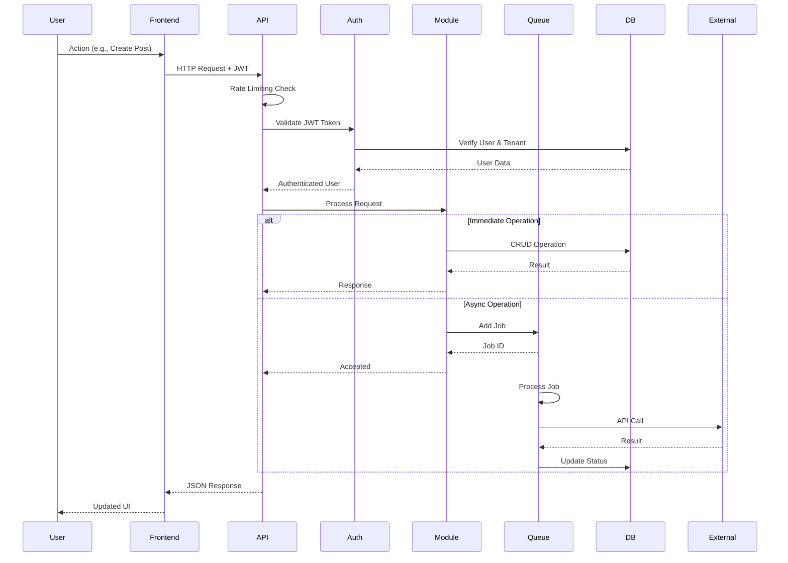
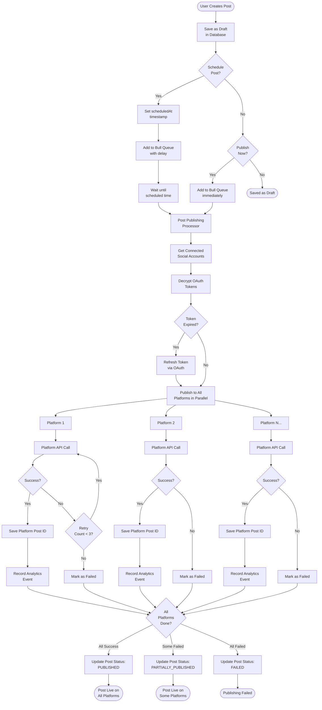
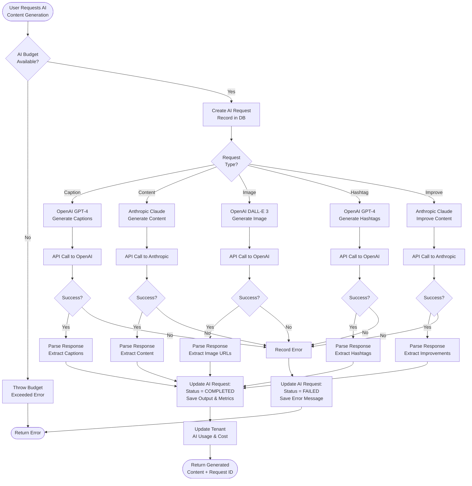
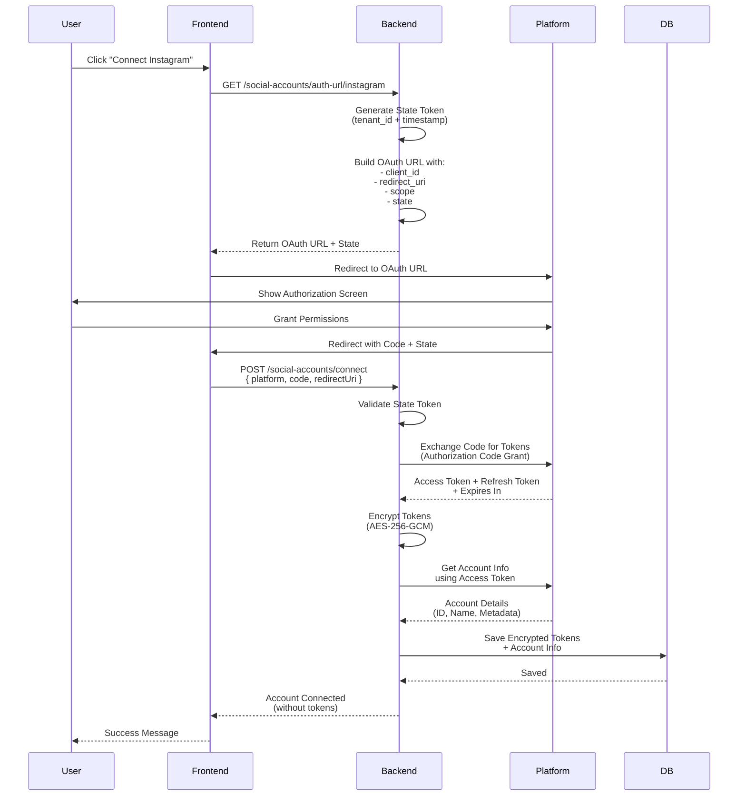
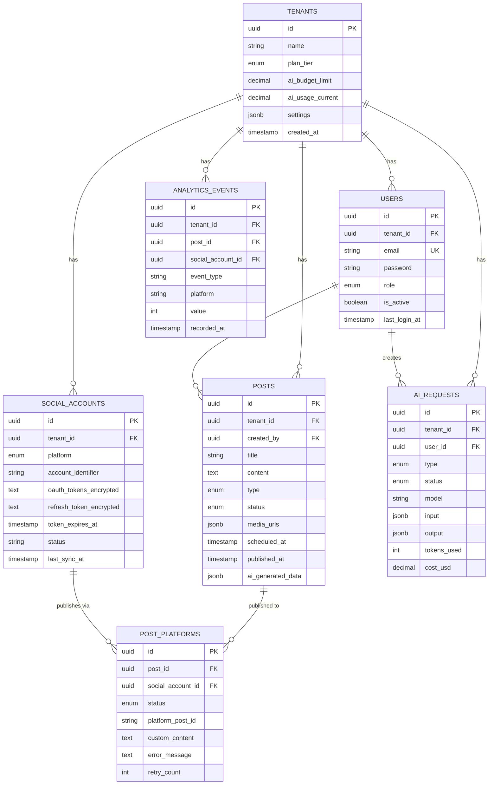
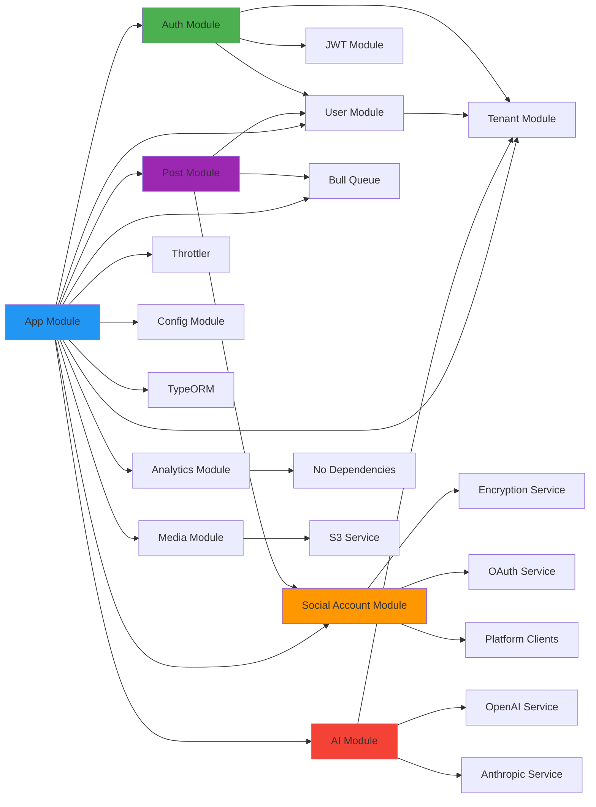

# Agentic Social Media Platform - System Architecture

## 🏗️ High-Level Architecture Flowchart

```mermaid
graph TB
    subgraph "Frontend Layer"
        FE[Next.js Frontend]
    end

    subgraph "API Gateway Layer"
        API[NestJS API Gateway<br/>Port: 3001<br/>Prefix: /api/v1]
        CORS[CORS Middleware]
        THROTTLE[Rate Limiter<br/>100 req/min]
        AUTH_GUARD[JWT Auth Guard]
        LOGGING[Logging Interceptor]
        ERROR[Global Exception Filter]
    end

    subgraph "Authentication & Authorization"
        AUTH_MODULE[Auth Module]
        JWT[JWT Service]
        PASSPORT[Passport.js]
        LOCAL[Local Strategy]
        JWT_STRAT[JWT Strategy]
    end

    subgraph "Core Business Modules"
        TENANT[Tenant Module<br/>Multi-tenancy]
        USER[User Module<br/>RBAC]
        SOCIAL[Social Account Module<br/>OAuth & Token Mgmt]
        POST[Post Module<br/>Content Management]
        AI[AI Module<br/>Content Generation]
        ANALYTICS[Analytics Module<br/>Metrics & Reporting]
        MEDIA[Media Module<br/>File Upload]
    end

    subgraph "Social Platform Integrations"
        OAUTH[OAuth Service<br/>9 Platforms]
        ENCRYPT[Encryption Service<br/>AES-256-GCM]
        FACTORY[Platform Client Factory]

        subgraph "Platform Clients"
            INSTA[Instagram Client]
            TWITTER[Twitter/X Client]
            LINKEDIN[LinkedIn Client]
            FACEBOOK[Facebook Client]
            TIKTOK[TikTok Client]
            YOUTUBE[YouTube Client]
            PINTEREST[Pinterest Client]
            THREADS[Threads Client]
            REDDIT[Reddit Client]
        end
    end

    subgraph "AI Services"
        OPENAI[OpenAI Service<br/>GPT-4 & DALL-E]
        ANTHROPIC[Anthropic Service<br/>Claude 3.5 Sonnet]
    end

    subgraph "Queue System"
        BULL[Bull Queue<br/>Redis-backed]
        POST_PROC[Post Publishing Processor]
        SCHEDULER[Post Scheduler]
    end

    subgraph "Data Layer"
        PG[(PostgreSQL 15<br/>Multi-tenant RLS)]
        REDIS[(Redis 7<br/>Cache & Queue)]
        S3[AWS S3<br/>Media Storage]
    end

    subgraph "External APIs"
        INSTA_API[Instagram Graph API]
        TWITTER_API[Twitter API v2]
        LINKEDIN_API[LinkedIn API]
        FACEBOOK_API[Facebook Graph API]
        TIKTOK_API[TikTok API]
        YOUTUBE_API[YouTube Data API]
        PINTEREST_API[Pinterest API v5]
        THREADS_API[Threads API]
        REDDIT_API[Reddit API]
        OPENAI_API[OpenAI API]
        ANTHROPIC_API[Anthropic API]
    end

    %% Frontend to API Gateway
    FE -->|HTTP/HTTPS| API

    %% API Gateway Flow
    API --> CORS
    CORS --> THROTTLE
    THROTTLE --> AUTH_GUARD
    AUTH_GUARD --> LOGGING
    LOGGING --> ERROR

    %% Authentication Flow
    AUTH_GUARD --> AUTH_MODULE
    AUTH_MODULE --> JWT
    AUTH_MODULE --> PASSPORT
    PASSPORT --> LOCAL
    PASSPORT --> JWT_STRAT

    %% Core Module Connections
    AUTH_MODULE --> TENANT
    AUTH_MODULE --> USER
    API --> TENANT
    API --> USER
    API --> SOCIAL
    API --> POST
    API --> AI
    API --> ANALYTICS
    API --> MEDIA

    %% Social Account Integration
    SOCIAL --> OAUTH
    SOCIAL --> ENCRYPT
    SOCIAL --> FACTORY
    FACTORY --> INSTA
    FACTORY --> TWITTER
    FACTORY --> LINKEDIN
    FACTORY --> FACEBOOK
    FACTORY --> TIKTOK
    FACTORY --> YOUTUBE
    FACTORY --> PINTEREST
    FACTORY --> THREADS
    FACTORY --> REDDIT

    %% AI Integration
    AI --> OPENAI
    AI --> ANTHROPIC
    AI --> TENANT

    %% Post Publishing Flow
    POST --> BULL
    BULL --> POST_PROC
    BULL --> SCHEDULER
    POST_PROC --> FACTORY

    %% Database Connections
    TENANT --> PG
    USER --> PG
    SOCIAL --> PG
    POST --> PG
    AI --> PG
    ANALYTICS --> PG
    BULL --> REDIS

    %% Media Storage
    MEDIA --> S3

    %% External API Calls
    INSTA --> INSTA_API
    TWITTER --> TWITTER_API
    LINKEDIN --> LINKEDIN_API
    FACEBOOK --> FACEBOOK_API
    TIKTOK --> TIKTOK_API
    YOUTUBE --> YOUTUBE_API
    PINTEREST --> PINTEREST_API
    THREADS --> THREADS_API
    REDDIT --> REDDIT_API
    OPENAI --> OPENAI_API
    ANTHROPIC --> ANTHROPIC_API

    style FE fill:#4CAF50
    style API fill:#2196F3
    style PG fill:#336791
    style REDIS fill:#DC382D
    style S3 fill:#FF9900
    style OPENAI fill:#10A37F
    style ANTHROPIC fill:#191919
```

## 🔄 Request Flow Diagram

## 📊 Data Flow for Multi-Platform Posting

## 🤖 AI Content Generation Flow

## 🔐 OAuth Authentication Flow

## 🗄️ Database Schema Overview

## 📦 Module Dependencies

---

## 📝 Key Architectural Decisions

### 1. **Multi-Tenancy with Row-Level Security (RLS)**
- Every table has `tenant_id`
- PostgreSQL RLS policies enforce tenant isolation
- Prevents data leakage between tenants

### 2. **Queue-Based Asynchronous Processing**
- Bull + Redis for job queues
- Scheduled posts processed at exact time
- Retry logic with exponential backoff
- Parallel platform publishing

### 3. **Encrypted Token Storage**
- AES-256-GCM encryption for OAuth tokens
- Unique salt + IV per encryption
- Authentication tags for tamper detection
- Secure key derivation with scrypt

### 4. **Platform-Agnostic Design**
- Factory pattern for platform clients
- Common interface for all social platforms
- Easy to add new platforms
- Centralized token management

### 5. **AI Cost Tracking**
- Per-request cost calculation
- Tenant-level budget enforcement
- Token usage tracking
- Request history for auditing

### 6. **Comprehensive Analytics**
- Event-based tracking system
- Real-time metrics aggregation
- Platform-specific breakdowns
- Engagement rate calculations

---

This architecture provides:
✅ **Scalability** - Horizontal scaling with stateless API
✅ **Security** - Encryption, RLS, JWT, rate limiting
✅ **Reliability** - Queue-based async processing with retries
✅ **Flexibility** - Modular design, easy to extend
✅ **Performance** - Redis caching, connection pooling
✅ **Observability** - Logging, error tracking, analytics
